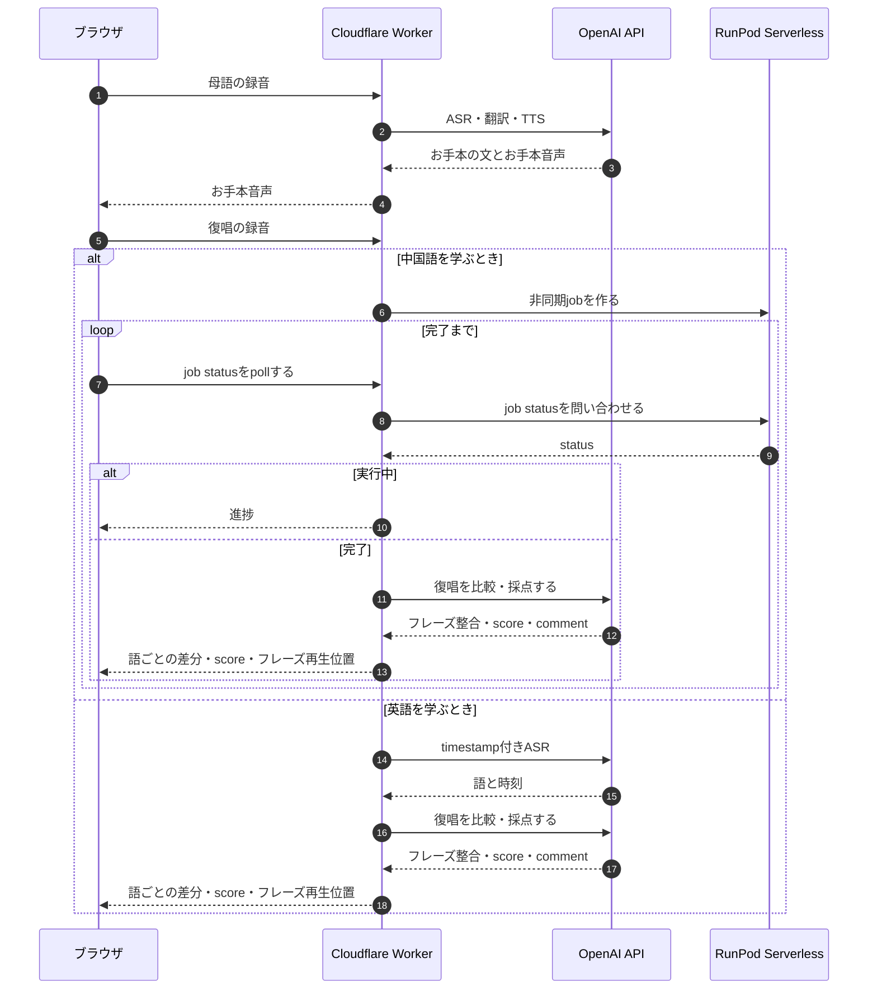
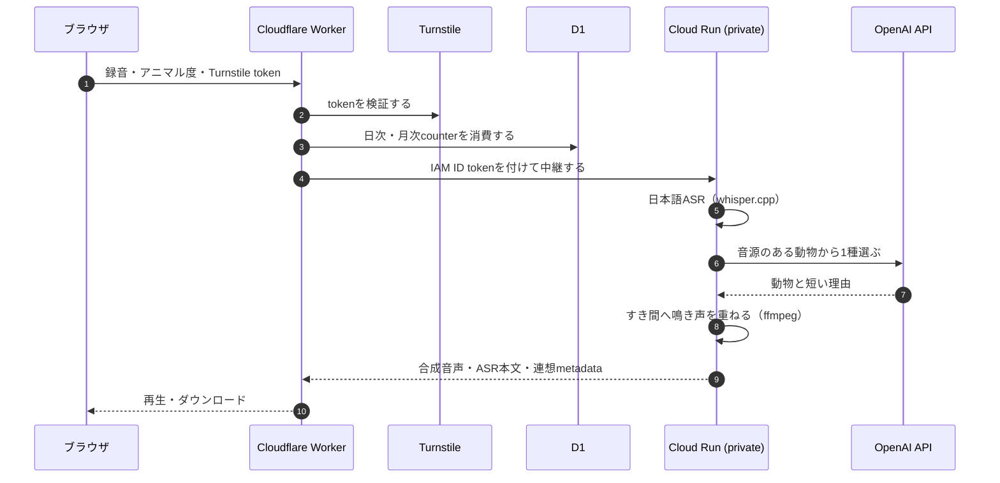

# Voice Lab

[](https://github.com/inakaegg/voice-lab/actions/workflows/ci.yml)
[](https://github.com/inakaegg/voice-lab/actions/workflows/secret-scan.yml)

Voice Labは、発音練習のSpeakLoopと動物鳴き声合成のZoovoiceを持つ音声Webアプリです。

中心機能のSpeakLoopは、母語で話した「言いたいこと」を、中国語または英語の発音練習へつなげます。録音、学習文と模範音声の生成、復唱、聞き比べまでを1つの流れで進められます。

Zoovoiceは、録音した日本語の発話から動物を1種自動で連想し、その鳴き声を発話のすき間へ重ねた音声を返します。

**公開デモ:** [https://voice-lab.inakaegg.workers.dev/](https://voice-lab.inakaegg.workers.dev/)

> **English:** [README.md](README.md)

## 画面

| ポータル | SpeakLoop練習画面 |
| --- | --- |
|  |  |


## デモ動画

スマートフォン実機での操作を収録した約2分のデモです。話した内容から「自分の声」によるお手本音声を生成し、練習結果を音声と文字で比較します。

**英語**

https://github.com/user-attachments/assets/018a157d-28b2-45fd-bac4-ab462f4cee9d

**中国語**

https://github.com/user-attachments/assets/4ef52293-8252-48bd-b1ae-0f942a24930d

## できること

### SpeakLoop — 発音練習

1. 母語で言いたい内容を録音する
2. 学習言語の文と模範音声を生成する
3. その文を発音して録音する
4. お手本と復唱を文字・音声の両方で比較する

お手本と復唱はtimestamp付きASRで解析し、聞こえた言葉の差分とフレーズ単位の再生位置を表示します。全文の交互再生に加え、気になるフレーズから聞き直せます。

任意の「自分の声」を使うと、同じ送信で最初に録音した本人の音声だけを参照し、模範音声を本人の声質に近づけたAI生成音声へ変換します。変換できない場合も通常のお手本音声で練習を続けられます。

### Zoovoice — 動物鳴き声合成

1. 日本語で自由に話して録音する
2. 発話内容から動物を1種自動で連想する
3. 鳴き声を発話のすき間へ重ねた音声を再生・ダウンロードする

日本語ASR、動物の自動連想、音声合成は、privateなGoogle Cloud Run上のGoサービスが担当します。連想はLLM（OpenAI API）が音源のある動物から1種を選びます。同梱する鳴き声はすべて実録音で、無償で商用利用できるものだけを使っています。

## 構成


図は [docs/diagrams/architecture.py](docs/diagrams/architecture.py) から生成します。英日の2枚は `uv run --no-project --with diagrams python docs/diagrams/architecture.py` で再生成します。

- ブラウザへOpenAIやRunPodのAPI keyを渡さず、Worker secretまたはサーバー環境変数で管理します。
- 公開版はGoogleログイン、機能別quota、入力上限、簡易監査ログをCloudflare Workerで処理します。
- 中国語の発音比較と任意の声質変換は、privateなRunPod Serverlessへ必要な音声だけを一時送信します。
- Zoovoiceの音声処理はprivateなGoogle Cloud Run上のGoサービス（whisper.cpp・OpenAI API・ffmpeg）が担当し、WorkerがGoogle IAM認証付きで中継します。
- ZoovoiceはCloudflare Turnstileで自動アクセスを抑止し、共通の利用上限をD1で管理します。
- Cloudflare公開版は、利用者の入力音声と生成音声をVoice Labの履歴として保存しません。
- GPU課金が必要な確認と、fake modelで検証できるrequest・job・error処理を分離しています。

### requestの経路

**SpeakLoop**。お手本の文とお手本音声はWorkerがOpenAIを呼んで作ります。復唱の比較・採点でもWorkerがOpenAIをもう一度呼びます。中国語の復唱ASRは非同期のRunPod jobで、ブラウザがWorkerを完了までpollingし、1回のpollごとにWorkerがRunPodの状態を1回確認します。待ち時間をそのまま進捗として表示できます。



**Zoovoice**。WorkerはTurnstile tokenと利用counterを先に確かめてから中継します。動物の連想はCloud Runが自分のOpenAIキーで呼ぶため、Workerを経由しません。



## ローカルセットアップ

Python 3.11以上とNode.js 22.18以上を使います。UI/APIとfake providerを動かす最小構成は次のとおりです。

```sh
python3 -m pip install -e ".[dev]"
npm ci
PYTHONPATH=src python3 -m uvicorn mo_speech.api:app --host 127.0.0.1 --port 8000
```

ブラウザで `http://127.0.0.1:8000/` を開きます。fake providerはUI/API検証用で、入力内容に依存しない固定応答を返します。

用途に応じた追加依存:

```sh
# ローカルASR・翻訳
python3 -m pip install -e ".[dev,local]"

# OpenAI API経路
python3 -m pip install -e ".[dev,openai]"
cp .env.example .env
```

モデル、生成音声、API key、`.env` はgit管理しません。声質変換の依存とモデル配置は [VOICE_CLONE.md](docs/speech-translation/VOICE_CLONE.md) を参照してください。

ZoovoiceのローカルUIとAPIはFastAPIを使わず、Wrangler localのWorkerとGoサービスで確認します。手順は [services/zoovoice/README.md](services/zoovoice/README.md) を参照してください。

## 検証

各worktreeでGitleaksのGit hookを有効にします。

```sh
brew install gitleaks
./scripts/install_git_hooks.sh
```

`pre-commit`はstaged差分、`pre-push`はGit履歴全体を検査します。全branchへのpushとpull requestでもGitHub Actionsが独立して再検査します。

通常の検証:

```sh
gitleaks git --redact --log-opts='--all' .
python3 -m pytest
npm test
npm run check:js
npm run check:worker
npm run check:web
npm run test:e2e
cd services/zoovoice && go vet ./... && go test ./...
```

RunPod image buildとGPU smokeは費用・実行時間が大きいため、通常CIには含めません。モデル非依存テストが通った後、必要な場合だけ最小入力で手動実行します。

## 公開デモ

Cloudflare Workerは `/` をポータル、`/speakloop` を発音練習画面、`/zoovoice` を動物鳴き声合成画面として配信します。production公開環境にはmerge済みの版を反映済みで、上記routeは公開中です。本branchで追加したUI変更（β表示の削除・使用技術表示・SpeakLoopのGitHub導線）はproduction未反映です。merge後にdeployとdeploy後smokeを実施します。

音声は生成・評価のため外部サービスで処理され、Voice Labの履歴には保存されません。個人情報や機密情報を含む音声は入力しないでください。詳しくは [プライバシーポリシー](docs/PRIVACY_POLICY.md) を確認してください。

## 既知の制限

- RunPod Serverlessはcold start、queue、GPU利用料金の影響を受けます。
- ZoovoiceのCloud Run合成は、cold startとASR・合成の処理時間の影響を受けます。
- ASR結果とフレーズ位置は変動します。要因は言語、発音、録音品質、providerの出力です。
- D1/KV bindingがないローカル・preview環境ではfallbackを使うため、productionと保存先が異なります。
- Safari、Firefox、スマートフォン実機の録音形式は継続確認が必要です。

詳細は [KNOWN_LIMITS.md](docs/speech-translation/KNOWN_LIMITS.md) を参照してください。

## 開発体制

個人開発です。実装にはAIコーディングエージェント（Claude Code、Codex）を利用しています。

作者が行うこと:

- 要件と仕様の決定、設計判断
- 変更ごとのレビューと、指摘の取捨選択
- 実データでの検証と、公開範囲・費用の判断

エージェントが行うこと:

- 設計案の提示、コードとテストの実装
- 実装とは別contextでのレビュー

品質は自動テスト、CI、secret scan、文書lint、別モデルによる相互レビューで担保します。運用ルールは [AGENTS.md](AGENTS.md) を参照してください。

## セキュリティとライセンス

脆弱性の連絡方法は [SECURITY.md](SECURITY.md) を参照してください。公開Issueへ秘密情報や個人情報を投稿しないでください。

Voice Lab本体にはオープンソースライセンスを付与していません。ソースコードの閲覧・評価を目的とするポートフォリオ公開を想定していますが、複製、改変、再配布などの許可は [LICENSE](LICENSE) に明記した範囲に限ります。評価・レビュー目的のcloneとローカル実行は、LICENSEの限定的な例外として許可しています。

依存ライブラリ、モデル、第三者実装にはそれぞれのライセンスと利用条件が適用されます。詳細は [THIRD_PARTY_NOTICES.md](THIRD_PARTY_NOTICES.md) を参照してください。

## 設計解説

比較再生の再生位置をどう決めているかと、その設計を選んだ理由を図解付きで公開しています。仕様の正本は [全体仕様](docs/speech-translation/SPEC.md) です。

- [比較再生: 再生位置の決め方とその理由](docs/speech-translation/COMPARISON_PLAYBACK_CASE_STUDY.md) — 何が壊れやすいか、なぜこの形にしたか、4つの役割、評価の数値とその限界

## ドキュメント

詳細文書の入口は [ドキュメント案内](docs/README.md) です。SpeakLoopの仕様、画面、実行経路、provider、公開運用という目的別に全文書を辿れます。

よく参照する文書:

- [CLI一覧](CLI.md) — 手元で機能を確かめるコマンドと出力例
- [全体仕様](docs/speech-translation/SPEC.md)
- [現在のデプロイ構成](docs/deployment/ARCHITECTURE.md)
- [既知の制限](docs/speech-translation/KNOWN_LIMITS.md)
- [プライバシーポリシー](docs/PRIVACY_POLICY.md)
