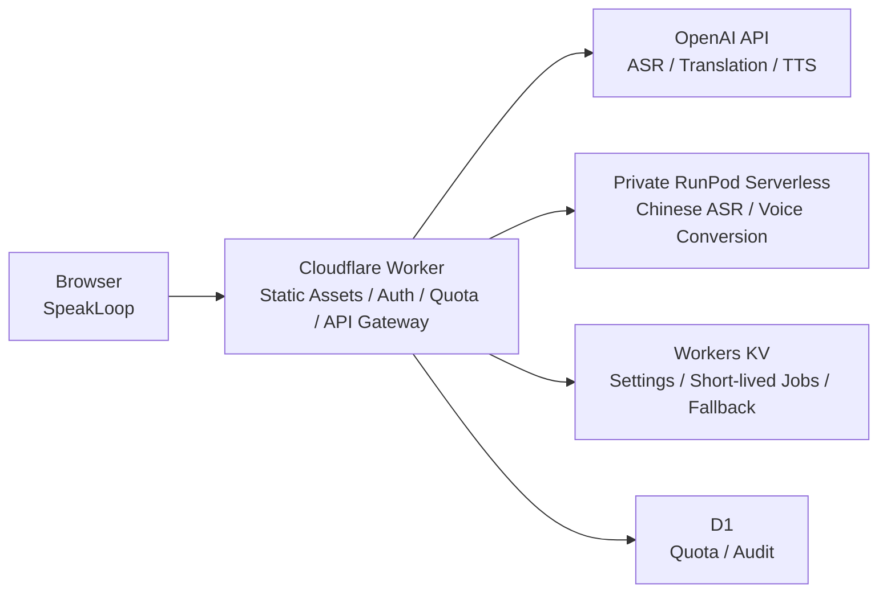

# SpeakLoop

Voice LabのSpeakLoopは、母語で話した「言いたいこと」を、中国語または英語の発音練習へつなげるWebアプリです。録音、学習文と模範音声の生成、復唱、聞き比べまでを1つの流れで進められます。

**公開デモ:** [https://voice-lab.inakaegg.workers.dev/](https://voice-lab.inakaegg.workers.dev/)

## できること

1. 母語で言いたい内容を録音する
2. 学習言語の文と模範音声を生成する
3. その文を発音して録音する
4. お手本と復唱を文字・音声の両方で比較する

お手本と復唱はtimestamp付きASRで解析し、聞こえた言葉の差分とフレーズ単位の再生位置を表示します。全文の交互再生に加え、気になるフレーズから聞き直せます。

任意の「自分の声」を使うと、同じ送信で最初に録音した本人の音声だけを参照し、模範音声を本人の声質に近づけたAI生成音声へ変換します。変換できない場合も通常のお手本音声で練習を続けられます。

## 構成



- ブラウザへOpenAIやRunPodのAPI keyを渡さず、Worker secretまたはサーバー環境変数で管理します。
- 公開版はGoogleログイン、機能別quota、入力上限、簡易監査ログをCloudflare Workerで処理します。
- 中国語の発音比較と任意の声質変換は、privateなRunPod Serverlessへ必要な音声だけを一時送信します。
- Cloudflare公開版は、利用者の入力音声と生成音声をVoice Labの履歴として保存しません。
- GPU課金が必要な確認と、fake modelで検証できるrequest・job・error処理を分離しています。

## ローカルセットアップ

Python 3.11以上とNode.jsを使います。UI/APIとfake providerを動かす最小構成は次のとおりです。

```sh
python3 -m pip install -e ".[dev]"
npm ci
PYTHONPATH=src python3 -m uvicorn mo_speech.api:app --host 127.0.0.1 --port 8000
```

ブラウザで `http://127.0.0.1:8000/` を開きます。fake providerはUI/API検証用で、入力内容に依存しない固定応答を返します。

用途に応じた追加依存:

```sh
# ローカルASR・翻訳
python3 -m pip install -e ".[dev,local]"

# OpenAI API経路
python3 -m pip install -e ".[dev,openai]"
cp .env.example .env
```

モデル、生成音声、API key、`.env` はgit管理しません。声質変換の依存とモデル配置は [VOICE_CLONE.md](docs/speech-translation/VOICE_CLONE.md) を参照してください。

## 検証

各worktreeでGitleaksのGit hookを有効にします。

```sh
brew install gitleaks
./scripts/install_git_hooks.sh
```

`pre-commit`はstaged差分、`pre-push`はGit履歴全体を検査します。全branchへのpushとpull requestでもGitHub Actionsが独立して再検査します。

通常の検証:

```sh
gitleaks git --redact --log-opts='--all' .
python3 -m pytest
npm test
npm run check:js
npm run check:web
npm run test:e2e
```

RunPod image buildとGPU smokeは費用・実行時間が大きいため、通常CIには含めません。モデル非依存テストが通った後、必要な場合だけ最小入力で手動実行します。

## 公開デモ

Cloudflare Workerは `/` をポータル、`/speakloop` を発音練習画面として配信します。現在の版はproduction公開環境へ反映済みです。

音声は生成・評価のため外部サービスで処理され、Voice Labの履歴には保存されません。個人情報や機密情報を含む音声は入力しないでください。詳しくは [プライバシーポリシー](docs/PRIVACY_POLICY.md) を確認してください。

## 既知の制限

- RunPod Serverlessはcold start、queue、GPU利用料金の影響を受けます。
- ASR結果とフレーズ位置は、言語、発音、録音品質、providerの出力により変動します。
- D1/KV bindingがないローカル・preview環境ではfallbackを使うため、productionと保存先が異なります。
- Safari、Firefox、スマートフォン実機の録音形式は継続確認が必要です。

詳細は [KNOWN_LIMITS.md](docs/speech-translation/KNOWN_LIMITS.md) を参照してください。

## セキュリティとライセンス

脆弱性の連絡方法は [SECURITY.md](SECURITY.md) を参照してください。公開Issueへ秘密情報や個人情報を投稿しないでください。

Voice Lab本体にはオープンソースライセンスを付与していません。ソースコードの閲覧・評価を目的とするポートフォリオ公開を想定していますが、複製、改変、再配布などの許可は [LICENSE](LICENSE) に明記した範囲に限ります。

依存ライブラリ、モデル、第三者実装にはそれぞれのライセンスと利用条件が適用されます。詳細は [THIRD_PARTY_NOTICES.md](THIRD_PARTY_NOTICES.md) を参照してください。

## ドキュメント

- [全体仕様](docs/speech-translation/SPEC.md)
- [現在のデプロイ構成](docs/deployment/ARCHITECTURE.md)
- [Cloudflareデモ構成](docs/deployment/CLOUDFLARE.md)
- [RunPod構成](docs/deployment/RUNPOD.md)
- [プライバシーポリシー](docs/PRIVACY_POLICY.md)
- [実装上のデータ取扱い境界](docs/deployment/PRIVACY.md)
- [既知の制限](docs/speech-translation/KNOWN_LIMITS.md)
