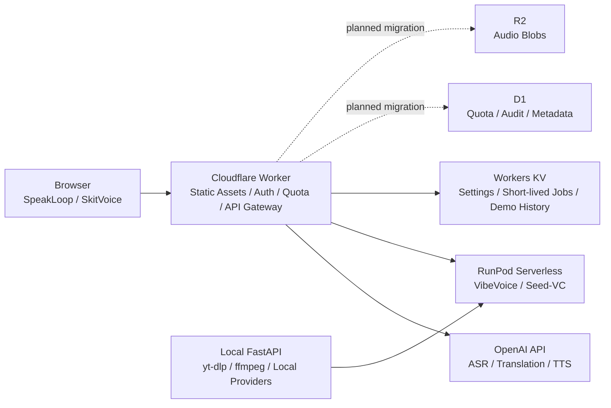

# Voice Lab — SpeakLoop / SkitVoice

音声を「学ぶ」「演じる」ための、ローカル実行と公開デモに対応したWebアプリです。公開ポータルから、発音練習の **SpeakLoop** と、複数話者スキット生成の **SkitVoice** を利用できます。

## できること

### SpeakLoop — 言いたいことで発音練習

1. 母語で言いたい内容を録音する
2. 学習言語の文と模範音声を生成する
3. その文を発音して録音する
4. ASR結果、類似度、フレーズ単位の交互再生で聞き比べる

日本語、中国語、英語を学習対象として選べます。

### SkitVoice — かんたんスキット生成

台本と最大4人分の参照音声から、複数話者のセリフ音声を生成します。VibeVoiceの生成結果をASR timestampで検査し、話者位置の補正、低スコア行の再生成、Seed-VCによる声質変換を組み合わせます。

参照音声は次の方法で指定できます。

| 実行環境 | ファイル | マイク録音 | タブ音声録音 | URL切り出し |
| --- | --- | --- | --- | --- |
| ローカルFastAPI | ○ | ○ | ○ | ○ |
| Cloudflare公開版 | ○ | ○ | ○ | — |
| RunPod handler | 音声bytesのみ受領 | 音声bytesのみ受領 | 音声bytesのみ受領 | — |

URL切り出しはローカル版の `yt-dlp` と `ffmpeg` だけが担当します。CloudflareとRunPodへURL、ブラウザcookie、ログイン情報は送りません。

## アーキテクチャ



- ブラウザへOpenAI/RunPodのAPI keyを渡さず、Worker secretまたはサーバー環境変数で管理します。
- 公開版はGoogleログイン、feature別quota、入力上限、管理者quota除外、簡易監査ログをWorkerで処理します。
- GPU課金が必要なテストと、fake modelで検証できるrequest・job・error処理を分離しています。

詳細は [Cloudflare構成](docs/deployment/CLOUDFLARE.md)、[RunPod構成](docs/deployment/RUNPOD.md)、[SkitVoice仕様](docs/speech-translation/VIBEVOICE.md) を参照してください。

## ローカルセットアップ

Python 3.11以上とNode.jsを使います。UI/APIとfake providerを動かす最小構成は次のとおりです。

```sh
python3 -m pip install -e ".[dev]"
npm ci
PYTHONPATH=src python3 -m uvicorn mo_speech.api:app --host 127.0.0.1 --port 8000
```

ブラウザで `http://127.0.0.1:8000/` を開きます。fake providerはUI/API検証用で、入力内容に依存しない固定応答を返します。

用途に応じた追加依存:

```sh
# ローカルASR・翻訳
python3 -m pip install -e ".[dev,local]"

# OpenAI API経路
python3 -m pip install -e ".[dev,openai]"
cp .env.example .env

# VibeVoice開発環境（依存が重いため専用環境を推奨）
python3 -m pip install -e ".[dev,vibevoice]"
```

声質クローン依存とモデル配置は [VOICE_CLONE.md](docs/speech-translation/VOICE_CLONE.md) を参照してください。モデル、生成音声、API key、`.env` はgit管理しません。

## 検証

通常CIと同じ主要検証:

```sh
python3 -m pytest
npm test
npm run check:js
```

RunPod image buildとGPU smokeは費用・実行時間が大きいため、通常CIには含めず手動workflowで実行します。ローカルでhandler、payload、env、シリアライズ、進捗、エラー処理を先に検証します。

## 公開デモ運用

Cloudflare Workerは `/` をポータル、`/speakloop` と `/skitvoice` を公開画面として配信します。Google OAuth、quota、管理画面、KV binding、secret、RunPod endpointの設定手順は [CLOUDFLARE.md](docs/deployment/CLOUDFLARE.md) にまとめています。

音声には個人情報や生体情報が含まれ得ます。公開デモでは機密音声を入力せず、SkitVoiceには本人の同意または利用許諾がある音声だけを使ってください。第三者へのなりすましや誤認を招く用途には使用しないでください。現在のデータ保持範囲は [既知の制限](docs/speech-translation/KNOWN_LIMITS.md) を参照してください。

## 既知の制限

- RunPod Serverlessはcold start、queue、GPU利用料金の影響を受けます。
- VibeVoiceの生成品質は言語、台本、参照音声、乱数に依存します。ASR検査と再生成を行っても完全な話者割当は保証しません。
- Workers KVは厳密な使用量台帳や大きい音声blobの長期保存には適しません。音声履歴は任意のR2 bindingへ保存でき、D1と公開サンプルを含む全面移行は未完了です。
- URL音声取得はYouTube等の仕様変更、ログイン要求、地域制限の影響を受けるローカル限定の補助機能です。
- Safari/Firefox、スマートフォン実機の録音形式・タブ音声共有は継続確認が必要です。

詳細は [KNOWN_LIMITS.md](docs/speech-translation/KNOWN_LIMITS.md) を参照してください。

## ドキュメント

- [全体仕様](docs/speech-translation/SPEC.md)
- [SkitVoice / VibeVoice](docs/speech-translation/VIBEVOICE.md)
- [Cloudflareデモ構成](docs/deployment/CLOUDFLARE.md)
- [RunPod構成](docs/deployment/RUNPOD.md)
- [公開デモ品質ロードマップ](docs/deployment/PUBLIC_DEMO_ROADMAP.md)
- [アプリ分離方針](docs/deployment/APP_SPLIT.md)
- [既知の制限](docs/speech-translation/KNOWN_LIMITS.md)
