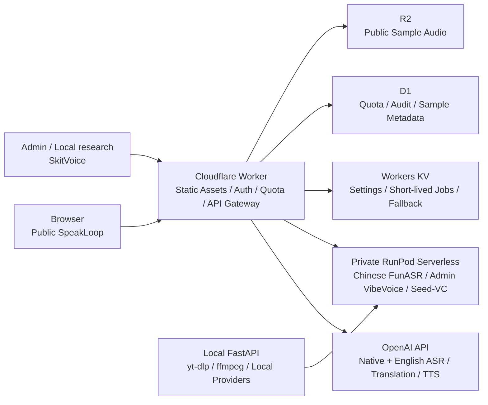

# Voice Lab — SpeakLoop

音声を使って発音を学ぶ、ローカル実行と公開デモに対応したWebアプリです。公開ポートフォリオの主機能は **SpeakLoop** です。複数話者スキット生成のSkitVoice/VibeVoiceは、一般公開製品ではなくprivateまたは管理者専用の研究機能として隔離します。

**公開デモ:** [https://voice-lab.inakaegg.workers.dev/](https://voice-lab.inakaegg.workers.dev/)

## できること

### SpeakLoop — 言いたいことで発音練習

1. 母語で言いたい内容を録音する
2. 学習言語の文と模範音声を生成する
3. その文を発音して録音する
4. お手本と復唱の両音声をtimestamp付きASRし、差分とフレーズ単位の交互再生で聞き比べる

現在は日本語話者向けとして、中国語と英語を学習対象に選べます。任意の `自分の声` を有効にすると、同じ送信で利用者本人が最初のステップとして録音した音声だけを参照音声に使い、模範TTSを本人の声質に近づけたAI生成音声へ変換します。別ファイル、タブ音声、URLを自己音声の参照には使えません。録音と模範TTSは処理のためRunPodへ一時送信されますが、Cloudflare版のVoice Lab音声履歴には保存しません。変換が失敗しても通常TTSを使う練習経路は維持します。

### SkitVoice — 管理者専用の研究機能

台本と最大4人分の参照音声から複数話者のセリフ音声を生成する実装は、ローカルFastAPIとCloudflareの管理者経路に残します。公開ポータルには製品導線、生成フォーム、由来未確認のサンプルを出さず、匿名利用者と通常のGoogleログイン利用者からVibeVoice APIをserver-sideで拒否します。これは暫定的な封じ込めであり、一般公開の安全性を証明するものではありません。

参照音声は次の方法で指定できます。

| 実行環境 | ファイル | マイク録音 | タブ音声録音 | URL切り出し |
| --- | --- | --- | --- | --- |
| ローカルFastAPI | ○ | ○ | ○ | ○ |
| Cloudflare管理者研究版 | ○ | ○ | ○ | — |
| RunPod handler | 音声bytesのみ受領 | 音声bytesのみ受領 | 音声bytesのみ受領 | — |

URL切り出しはローカル版の `yt-dlp` と `ffmpeg` だけが担当します。CloudflareとRunPodへURL、ブラウザcookie、ログイン情報は送りません。

## アーキテクチャ



- ブラウザへOpenAI/RunPodのAPI keyを渡さず、Worker secretまたはサーバー環境変数で管理します。
- 公開版はGoogleログイン、feature別quota、入力上限、管理者quota除外、簡易監査ログをWorkerで処理します。
- GPU課金が必要なテストと、fake modelで検証できるrequest・job・error処理を分離しています。
- 中国語復唱はRunPodの非同期jobとprogress updateを使い、GPU worker待ち、初期化、FunASR処理中、完了／失敗を画面に表示します。
- 管理者専用SkitVoiceもRunPodの非同期進捗を表示しますが、VibeVoice runtimeとcontainer imageはprivate維持を前提にします。

詳細は [Cloudflare構成](docs/deployment/CLOUDFLARE.md)、[RunPod構成](docs/deployment/RUNPOD.md)、[SkitVoice仕様](docs/speech-translation/VIBEVOICE.md) を参照してください。

## ローカルセットアップ

Python 3.11以上とNode.jsを使います。UI/APIとfake providerを動かす最小構成は次のとおりです。

```sh
python3 -m pip install -e ".[dev]"
npm ci
PYTHONPATH=src python3 -m uvicorn mo_speech.api:app --host 127.0.0.1 --port 8000
```

ブラウザで `http://127.0.0.1:8000/` を開きます。fake providerはUI/API検証用で、入力内容に依存しない固定応答を返します。

commitやpushで秘密情報をGitHubへ送る前に停止できるよう、各worktreeでGitleaksのGit hookを有効にします。macOSでは次を実行します。

```sh
brew install gitleaks
./scripts/install_git_hooks.sh
```

`pre-commit`はstaged差分、`pre-push`はGit履歴全体を検査します。hookはローカルで省略・解除できるため、全branchへのpushとpull requestでもGitHub Actionsが独立して再検査します。GitHub側ではPush Protectionも別途有効にし、remoteがpushを受理する前の防止層として使います。

ローカル版では `/skitvoice/admin` から研究用サンプル音声を管理できます。保存先は既定でgit管理外の `tmp/public-sample-audios.json`、変更する場合は `MO_PUBLIC_SAMPLE_AUDIO_PATH` を指定します。由来・許諾・生成model・AI生成表示を確認できない既存SkitVoiceサンプルは、Cloudflareの一般向けsample APIから返しません。外部R2 objectの削除はこのローカル変更に含みません。SpeakLoopにはサンプル音声を表示しません。

音声履歴はローカルFastAPI版だけで利用できます。Cloudflare公開版は、ユーザーが入力した音声と生成音声を履歴として保存しません。公開サンプル音声、quota、監査情報は別用途のデータとしてD1/R2/KVへ保存します。

用途に応じた追加依存:

```sh
# ローカルASR・翻訳
python3 -m pip install -e ".[dev,local]"

# OpenAI API経路
python3 -m pip install -e ".[dev,openai]"
cp .env.example .env

# VibeVoiceローカル開発環境（依存が重いため専用環境を推奨）
# URL参照音声の切り出しも使う場合だけurl-referenceを含める
python3 -m pip install -e ".[dev,vibevoice,url-reference]"
```

声質クローン依存とモデル配置は [VOICE_CLONE.md](docs/speech-translation/VOICE_CLONE.md) を参照してください。モデル、生成音声、API key、`.env` はgit管理しません。

## 検証

ローカルの主要検証:

```sh
gitleaks git --redact --log-opts='--all' .
python3 -m pytest
npm test
npm run check:js
npm run check:web
npm run test:e2e
```

Playwrightを初めて使う環境では、先に`npx playwright install chromium`を実行します。UI検証の対象状態とviewportは [UIテスト方針](docs/UI_TESTING.md) を参照してください。

RunPod image buildとGPU smokeは費用・実行時間が大きいため、通常CIには含めず手動workflowで実行します。ローカルでhandler、payload、env、シリアライズ、進捗、エラー処理を先に検証します。

## 公開デモ運用

Cloudflare Workerは `/` をSpeakLoop中心のポータル、`/speakloop` を公開画面として配信します。`/skitvoice` は研究機能が一般公開されていないことを示す非生成画面です。`/admin`、`/speakloop/admin`、`/skitvoice/admin` と実験画面 `/fun` は、許可メールを使うGoogle OAuth管理者認証で保護します。VibeVoiceのstatus、script、submit、status/cancelを含む全APIも同じ管理者認証で保護します。この変更はmerge済みmainのCloudflare previewで検証済みですが、本番未deployであり、現在のproduction公開環境へ反映済みとは扱いません。

音声には個人情報や生体情報が含まれ得ます。公開デモでは機密音声を入力しないでください。利用者向けの説明は [プライバシーポリシー](docs/PRIVACY_POLICY.md)、実装上の詳細は [公開デモのデータ取扱い境界](docs/deployment/PRIVACY.md) を参照してください。公開デモからは `/privacy` で確認できます。

## 既知の制限

- RunPod Serverlessはcold start、queue、GPU利用料金の影響を受けます。
- VibeVoiceの生成品質は言語、台本、参照音声、乱数に依存します。ASR検査と再生成を行っても完全な話者割当は保証しません。
- D1/R2 bindingがないローカル・preview環境ではKV fallbackを使います。短期job stateは現在もKVであり、厳密な課金台帳や永続workflow engineではありません。
- URL音声取得はYouTube等の仕様変更、ログイン要求、地域制限の影響を受けるローカル限定の補助機能です。
- Safari/Firefox、スマートフォン実機の録音形式・タブ音声共有は継続確認が必要です。

詳細は [KNOWN_LIMITS.md](docs/speech-translation/KNOWN_LIMITS.md) を参照してください。

脆弱性の連絡方法は [SECURITY.md](SECURITY.md) を参照してください。公開Issueへ秘密情報や個人情報を投稿しないでください。

## ライセンスと再利用

Voice Lab本体にはオープンソースライセンスを付与していません。ソースコードの閲覧・評価を目的とするポートフォリオ公開を想定していますが、複製、改変、再配布などの許可は [LICENSE](LICENSE) に明記した範囲に限ります。

依存ライブラリ、モデル、第三者実装にはそれぞれのライセンスと利用条件が適用されます。frontend bundleのライセンス本文と、Seed-VC、VibeVoice等の配布境界は [THIRD_PARTY_NOTICES.md](THIRD_PARTY_NOTICES.md) を参照してください。

## ドキュメント

- [全体仕様](docs/speech-translation/SPEC.md)
- [SkitVoice / VibeVoice](docs/speech-translation/VIBEVOICE.md)
- [Cloudflareデモ構成](docs/deployment/CLOUDFLARE.md)
- [RunPod構成](docs/deployment/RUNPOD.md)
- [公開デモのデータ取扱い境界](docs/deployment/PRIVACY.md)
- [公開前チェックリスト](docs/deployment/PUBLICATION_CHECKLIST.md)
- [公開デモ品質ロードマップ](docs/deployment/PUBLIC_DEMO_ROADMAP.md)
- [アプリ分離方針](docs/deployment/APP_SPLIT.md)
- [既知の制限](docs/speech-translation/KNOWN_LIMITS.md)
