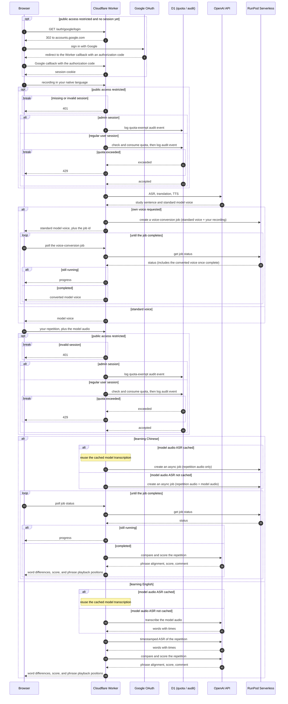
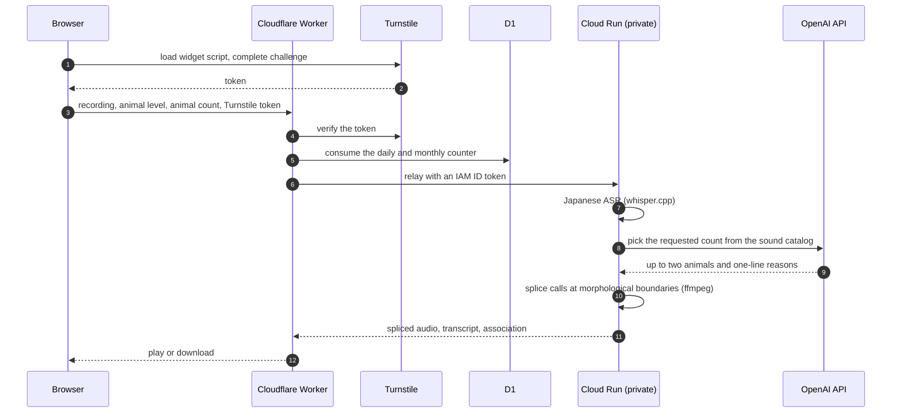

# Voice Lab

[](https://github.com/inakaegg/voice-lab/actions/workflows/ci.yml)
[](https://github.com/inakaegg/voice-lab/actions/workflows/secret-scan.yml)

🇯🇵 日本語ドキュメント: [README.ja.md](README.ja.md)

Voice Lab is a voice web app with two features: SpeakLoop for pronunciation practice and Zoovoice for animal-call synthesis.

SpeakLoop, the main feature, turns what you say in your native language into pronunciation practice in Chinese or English. Recording, generation of a study sentence and a model voice, repetition, and comparison all happen in one flow.

Zoovoice transcribes a free-form Japanese recording and picks one or two animals the utterance evokes. It returns your speech with their calls spliced in at word boundaries.

**Live demo:** [https://voice-lab.inakaegg.workers.dev/](https://voice-lab.inakaegg.workers.dev/)

## Screens

| Portal | SpeakLoop practice screen |
| --- | --- |
|  |  |

## Demo videos

A roughly two-minute demo recorded on a real smartphone. It generates a model voice in "your own voice" from what you said, then compares the practice result as text and audio.

**English**

https://github.com/user-attachments/assets/018a157d-28b2-45fd-bac4-ab462f4cee9d

**Chinese**

https://github.com/user-attachments/assets/4ef52293-8252-48bd-b1ae-0f942a24930d

## Why I built it

I am a Japanese speaker studying Chinese. Textbook sentences rarely match what I actually want to say, so I built a practice loop that starts from my own words instead. I use it for my own study, and it doubles as a portfolio piece showing how I design, test, and operate a product end to end.

## What it does

### SpeakLoop — pronunciation practice

1. Record what you want to say in your native language
2. Generate a sentence and a model voice in the language you are learning
3. Record yourself saying that sentence
4. Compare the model and your repetition, as text and as audio

The model and your repetition are analyzed with timestamp-aligned ASR. The app shows the heard-word differences between the model and your repetition, with phrase-level playback positions. You can alternate playback of the full sentence or replay from the exact phrase you care about.

With the optional "own voice" mode, the app references only your own recording from the same submission. It converts the model voice into AI-generated audio close to your own voice quality. When conversion is not possible, practice continues with the standard model voice.

### Zoovoice — animal-call synthesis

1. Record free-form Japanese speech
2. One or two animals are automatically associated from what you said
3. Play or download your speech with the animal's call spliced in at word boundaries

Japanese ASR, animal association, and synthesis run on a private Go service on Google Cloud Run. An LLM (OpenAI API) picks the animals from those with available recordings. All bundled calls are real recordings licensed for free commercial use.

## Architecture


The diagram is generated from [docs/diagrams/architecture.py](docs/diagrams/architecture.py). Regenerate both language versions with `uv run --no-project --with diagrams python docs/diagrams/architecture.py`.

- API keys for OpenAI and RunPod never reach the browser. They live in Worker secrets or server-side environment variables.
- The public deployment handles Google login, per-feature quotas, input limits, and a simple audit log in the Cloudflare Worker.
- Usage beyond the free quota can draw on a prepaid credit balance managed by a separate billing service in a private repository. That integration is behind a feature flag, off by default. Running and testing this repository locally needs nothing from the billing service; see [the Cloudflare deployment notes](docs/deployment/CLOUDFLARE.md) for what a deployment to another account has to do. The codebase holds only a thin client and a test fake.
- Chinese pronunciation comparison and optional voice conversion temporarily send only the required audio to a private RunPod Serverless backend.
- Zoovoice audio processing runs on a private Go service on Google Cloud Run (whisper.cpp, OpenAI API, ffmpeg). The Worker relays with a Google-issued ID token. On a token-cache miss, it exchanges a signed service-account JWT for a new ID token at Google's token endpoint.
- Zoovoice uses Cloudflare Turnstile against automated access, with shared usage limits managed in D1.
- The public Cloudflare deployment does not store user input audio or generated audio as Voice Lab history.
- Checks that require GPU billing are separated from the request, job, and error handling that a fake model can verify.

### Request paths

**SpeakLoop.** On deployments with public access restricted, you sign in with Google first by opening `GET /auth/google/login`; the Worker does not redirect you there on its own. Each prompt or attempt submission checks access before any OpenAI or RunPod call. A missing session returns 401. A regular user consumes D1 quota and writes an audit event; an exceeded quota returns 429. An admin writes a quota-exempt audit event instead. Rejected submissions never reach a provider. Status polling only rechecks the session, so it neither consumes quota nor writes an audit event.

Every comparison submission sends both your repetition and the model audio to the Worker. OpenAI for English or RunPod for Chinese always transcribes the repetition. On a reference-ASR cache miss, the provider also receives and transcribes the model audio. On a cache hit for the same audio, language, and provider model, the Worker reuses the reference transcription and does not send the model audio to the provider. After ASR, the Worker calls OpenAI to compare and score the repetition.

The Worker calls OpenAI for the study sentence and standard model voice. Optional own-voice conversion runs as an asynchronous RunPod Seed-VC job, and Chinese repetition ASR also runs as an asynchronous RunPod job. For both jobs, the browser polls the Worker until completion. Each poll makes one RunPod status request and returns real progress or the completed result.


```mermaid
sequenceDiagram
    autonumber
    participant B as Browser
    participant W as Cloudflare Worker
    participant G as Google OAuth
    participant D as D1 (quota / audit)
    participant O as OpenAI API
    participant R as RunPod Serverless
    opt public access restricted and no session yet
        B->>W: GET /auth/google/login
        W-->>B: 302 to accounts.google.com
        B->>G: sign in with Google
        G-->>B: redirect to the Worker callback with an authorization code
        B->>W: Google callback with the authorization code
        W-->>B: session cookie
    end
    B->>W: recording in your native language
    opt public access restricted
        break missing or invalid session
            W-->>B: 401
        end
        alt admin session
            W->>D: log quota-exempt audit event
        else regular user session
            W->>D: check and consume quota, then log audit event
            break quota exceeded
                D-->>W: exceeded
                W-->>B: 429
            end
            D-->>W: accepted
        end
    end
    W->>O: ASR, translation, TTS
    O-->>W: study sentence and standard model voice
    alt own voice requested
        W->>R: create a voice-conversion job (standard voice + your recording)
        W-->>B: standard model voice, plus the job id
        loop until the job completes
            B->>W: poll the voice-conversion job
            W->>R: get job status
            R-->>W: status (includes the converted voice once complete)
            alt still running
                W-->>B: progress
            else completed
                W-->>B: converted model voice
            end
        end
    else standard voice
        W-->>B: model voice
    end
    B->>W: your repetition, plus the model audio
    opt public access restricted
        break invalid session
            W-->>B: 401
        end
        alt admin session
            W->>D: log quota-exempt audit event
        else regular user session
            W->>D: check and consume quota, then log audit event
            break quota exceeded
                D-->>W: exceeded
                W-->>B: 429
            end
            D-->>W: accepted
        end
    end
    alt learning Chinese
        alt model audio ASR cached
            Note over W: reuse the cached model transcription
            W->>R: create an async job (repetition audio only)
        else model audio ASR not cached
            W->>R: create an async job (repetition audio + model audio)
        end
        loop until the job completes
            B->>W: poll job status
            W->>R: get job status
            R-->>W: status
            alt still running
                W-->>B: progress
            else completed
                W->>O: compare and score the repetition
                O-->>W: phrase alignment, score, comment
                W-->>B: word differences, score, and phrase playback positions
            end
        end
    else learning English
        alt model audio ASR cached
            Note over W: reuse the cached model transcription
        else model audio ASR not cached
            W->>O: transcribe the model audio
            O-->>W: words with times
        end
        W->>O: timestamped ASR of the repetition
        O-->>W: words with times
        W->>O: compare and score the repetition
        O-->>W: phrase alignment, score, comment
        W-->>B: word differences, score, and phrase playback positions
    end
```

**Zoovoice.** The browser loads the Turnstile widget script and completes the challenge directly with Cloudflare, outside the Worker. The Worker then verifies that token and the usage counter before it relays anything. Cloud Run holds its own OpenAI key, so the animal association never passes through the Worker.


```mermaid
sequenceDiagram
    autonumber
    participant B as Browser
    participant W as Cloudflare Worker
    participant T as Turnstile
    participant D as D1
    participant C as Cloud Run (private)
    participant O as OpenAI API
    B->>T: load widget script, complete challenge
    T-->>B: token
    B->>W: recording, animal level, animal count, Turnstile token
    W->>T: verify the token
    W->>D: consume the daily and monthly counter
    W->>C: relay with an IAM ID token
    C->>C: Japanese ASR (whisper.cpp)
    C->>O: pick the requested count from the sound catalog
    O-->>C: up to two animals and one-line reasons
    C->>C: splice calls at morphological boundaries (ffmpeg)
    C-->>W: spliced audio, transcript, association
    W-->>B: play or download
```

## Three engineering decisions

The parts I would walk through first in a code review.

**1. A fake provider keeps GPUs and billing out of tests.** The speech pipeline sits behind a provider interface. Local tests and CI run against a fake provider that returns fixed responses independent of input. Request handling, job state, and error paths are verified without a GPU or an API key. GPU-dependent smoke checks run manually with minimal input, only after the model-independent tests pass.

**2. Secrets scanning runs at three independent stages.** Gitleaks runs at pre-commit on staged diffs and at pre-push on the entire Git history. GitHub Actions re-scans independently on every push and pull request. A hook skipped on one machine still gets caught before anything ships.

**3. No credential reaches the browser.** The browser never receives OpenAI or RunPod API keys. The Cloudflare Worker holds the SpeakLoop credentials, enforces auth and quotas, and forwards only the audio a request needs to the private backends. Zoovoice's OpenAI key lives only in the Cloud Run service and never passes through the Worker. The public deployment keeps no history of user audio.

## Local setup

Use Python 3.11+ and Node.js 22.18+. The minimal setup runs the UI/API with the fake provider:

```sh
python3 -m pip install -e ".[dev]"
npm ci
PYTHONPATH=src python3 -m uvicorn mo_speech.api:app --host 127.0.0.1 --port 8000
```

Open `http://127.0.0.1:8000/` in a browser. The fake provider is for UI/API verification and returns fixed responses independent of input.

Optional extras by purpose:

```sh
# Local ASR / translation
python3 -m pip install -e ".[dev,local]"

# OpenAI API path
python3 -m pip install -e ".[dev,openai]"
cp .env.example .env
```

Models, generated audio, API keys, and `.env` stay out of Git. For voice-conversion dependencies and model placement, see [VOICE_CLONE.md](docs/speech-translation/VOICE_CLONE.md).

The local Zoovoice UI and API do not use FastAPI. Verify them with the Wrangler local Worker and the Go service. See [services/zoovoice/README.md](services/zoovoice/README.md).

## Verification

Enable the gitleaks Git hooks in each worktree:

```sh
brew install gitleaks
./scripts/install_git_hooks.sh
```

`pre-commit` scans staged diffs; `pre-push` scans the entire Git history. GitHub Actions re-scans independently on pushes to all branches and on pull requests.

Routine checks:

```sh
gitleaks git --redact --log-opts='--all' .
python3 -m pytest
npm test
npm run check:js
npm run check:worker
npm run check:web
npm run test:e2e
cd services/zoovoice && go vet ./... && go test ./...
```

RunPod image builds and GPU smoke checks cost real money and take time, so routine CI excludes them. They run manually with minimal input, only when needed and after the model-independent tests pass.

## Public demo

The Cloudflare Worker serves `/` as the portal, `/speakloop` as the practice screen, and `/zoovoice` as the animal-call screen. The routes above are live in the production environment.

Audio is processed by external services for generation and evaluation, and is not stored as Voice Lab history. Do not record audio containing personal or confidential information. Details: [privacy policy](docs/PRIVACY_POLICY.md).

## Known limits

- RunPod Serverless is subject to cold starts, queuing, and GPU pricing.
- Zoovoice synthesis on Cloud Run is subject to cold starts and ASR/synthesis processing time.
- ASR results and phrase positions vary with language, pronunciation, recording quality, and provider output.
- Local and preview environments without D1/KV bindings use fallbacks, so storage differs from production.
- Recording formats on Safari, Firefox, and physical smartphones need continued verification.

Details: [KNOWN_LIMITS.md](docs/speech-translation/KNOWN_LIMITS.md).

## How it is developed

This is a solo project. Implementation uses AI coding agents (Claude Code and Codex).

The author:

- decides requirements, specifications, and design
- reviews every change and triages the findings
- verifies with real data and makes publication and cost decisions

The agents:

- propose designs, implement code and tests
- review implementations in a context separate from the implementer

Quality relies on automated tests and CI, secret scanning, docs linting, and cross-review between different models. Operating rules: [AGENTS.md](AGENTS.md).

## Security and license

For vulnerability reports, see [SECURITY.md](SECURITY.md). Do not post secrets or personal information in public issues.

Voice Lab itself is not under an open-source license. The repository is public as a portfolio for reading and evaluating the source code. Copying, modification, and redistribution are allowed only within the scope stated in [LICENSE](LICENSE). Cloning and running locally for evaluation and review are permitted as a limited exception in the LICENSE.

Dependencies, models, and third-party implementations keep their own licenses and terms. See [THIRD_PARTY_NOTICES.md](THIRD_PARTY_NOTICES.md).

## Design write-ups

How comparison playback chooses its playback positions, and why that design was chosen, is published with diagrams. The normative spec is [SPEC.md](docs/speech-translation/SPEC.md) (Japanese, English summary at the top).

- [Comparison playback: how positions are chosen and why](docs/speech-translation/COMPARISON_PLAYBACK_CASE_STUDY.md) (Japanese). Covers what makes it hard, why this shape, the four roles, and the evaluation numbers with their limits.

## Documentation

The documentation index is [docs/README.md](docs/README.md) (Japanese). It organizes all documents by purpose, from the SpeakLoop spec and screens to execution paths, providers, and public operation.

Frequently used documents (Japanese; the ones marked below carry an English summary at the top):

- [CLI.md](CLI.md) — copy-ready Zoovoice commands for local verification
- [Full spec](docs/speech-translation/SPEC.md) — English summary included
- [Deployment architecture](docs/deployment/ARCHITECTURE.md) — English summary included
- [Known limits](docs/speech-translation/KNOWN_LIMITS.md) — English summary included
- [Privacy policy](docs/PRIVACY_POLICY.md) — English summary included
