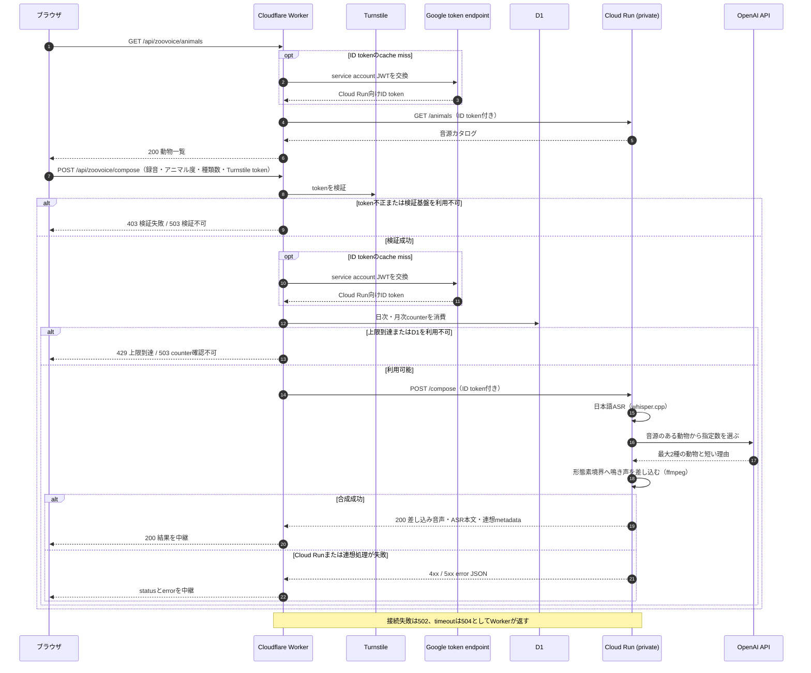

# 現在のデプロイ構成

更新日: 2026-08-24

## English summary

- Current deployment architecture. The Japanese text below is the source of truth.
- One Cloudflare Worker serves SpeakLoop and Zoovoice. Static Assets deliver the UI; the Worker module handles auth, quotas, and API relay.
- SpeakLoop GPU inference runs on RunPod Serverless. Zoovoice audio processing runs on a private Go service on Google Cloud Run.
- Data boundaries: KV for settings and short-lived jobs / D1 for quotas, audit, and counters / R2 for sample blobs. Practice audio is not stored as history.
- Cloud Run is private (IAM only). The Worker calls it with an ID token from a dedicated invoker service account.
- Terraform (`infra/`) is the source of truth for cloud resources; see `infra/README.md`.

## 構成

Voice Labの公開版は、1つのCloudflare WorkerでSpeakLoopとZoovoiceを配信する。UIはWorker Static Assets、認証・quota・API中継はWorker moduleが担当する。SpeakLoopのGPU推論はRunPod Serverless、Zoovoiceの音声処理はprivateなGoogle Cloud Run上のGoサービスが担当する。この構成はproduction公開環境へ反映済みである。productionは単一Workerだけを使い、staging環境は持たない。

図は [architecture.py](../diagrams/architecture.py) から生成する。英日の2枚は `uv run --no-project --with diagrams python docs/diagrams/architecture.py` で再生成する。

SpeakLoopのローカル版はFastAPIがUIとAPIを配信する。Zoovoiceのローカル確認はWrangler localのWorkerとGoサービスで行う。

## routeと認証

| route | 用途 | 公開版 |
| --- | --- | --- |
| `/` | ポータル | 公開 |
| `/speakloop` | SpeakLoop | 公開 |
| `/zoovoice` | Zoovoice | `ZOOVOICE_ENABLED=1` の配備だけ公開 |
| `/admin` | 総合管理 | 管理者の認証が必須 |
| `/speakloop/admin` | SpeakLoop管理 | 管理者の認証が必須 |

SpeakLoopの公開生成APIと管理画面は同じGoogle OAuthセッションを使い、別の管理パスワードや管理者cookieは持たない。管理者判定・quota・secretの詳細は [CLOUDFLARE.md](CLOUDFLARE.md) を正とする。

## データ境界

- KV: 設定、短期job snapshot、ready状態、binding不足時のfallback
- D1: email hashを使うquota、監査イベント、公開サンプルmetadata、Zoovoice利用counter
- R2: 管理者が登録したsample音声のblob
- RunPod: GPU jobの入力、途中progress、結果。長期保存の正にはしない
- Cloud Run: Zoovoiceの録音、合成音声、連想metadata。応答の生成に必要な間だけ扱い、永続保存しない

SpeakLoopの中国語比較はRunPodのjob IDをブラウザへ返し、WorkerまたはFastAPIがRunPod statusを都度中継する。練習音声とjob結果をCloudflare側へ履歴保存しない。

詳細は [CLOUDFLARE.md](CLOUDFLARE.md)、[STORAGE.md](STORAGE.md)、[RUNPOD.md](RUNPOD.md)、[PRIVACY.md](PRIVACY.md) を参照する。

## Zoovoice

Zoovoiceは、録音した発話の内容から動物を自動で選び、その鳴き声を言葉の切れ目へ差し込む機能である。機能仕様と用語は [SPEC.md](../speech-translation/SPEC.md) を正とする。Workerは `ZOOVOICE_ENABLED=1` の配備だけで公開routeとAPIを提供する。

Cloud Run上のGoサービスが日本語ASR（whisper.cpp）、動物の自動連想（LLM）、音声合成をこの順で担当する。連想は合成1回につきOpenAIのResponses APIを1回だけ呼び、利用は日次・月次counterで抑える。連想方式の採否と費用・依存リスクの実測は [ZOOVOICE_ASSOCIATION_CASE_STUDY.md](../speech-translation/ZOOVOICE_ASSOCIATION_CASE_STUDY.md) を正とする。

Cloud Runはprivate IAMを前提とし、ブラウザからCloud Runへ直接送る経路は持たない。WorkerがID token付きで中継する認証フローとsecret運用は [CLOUDFLARE.md](CLOUDFLARE.md) を正とする。Goサービスの実装、Docker image、配備script、外部操作の状況は [services/zoovoice/README.md](../../services/zoovoice/README.md) を正とする。

WorkerはCloud Runの応答形を厳密に検証するため、両者を同じcommitから続けてdeployする。二形状を同時に受理する互換層は持たない。

直近のUI変更（β版バッジの削除）はproduction未反映である。feature branchのmerge後にWorker deployとdeploy後smokeを実施する。

未確認として残るのはWorker経由の実 `POST /api/zoovoice/compose` 1件である。この経路にはproduction Turnstileの人間操作が必要であり、CAPTCHAは回避しないため自動smokeの対象にしない。確認済み・未確認の内訳は [services/zoovoice/README.md](../../services/zoovoice/README.md) の「外部操作の状況」を正とする。

## IaC（Terraform）

CloudflareとGoogle Cloudの構成はTerraformを正本とし、コードは `infra/cloudflare/` と `infra/gcp/` に分かれる。管理対象と対象外、認証、使い方は [infra/README.md](../../infra/README.md) を正とする。Workerスクリプト本体とsecretはTerraformの対象外で、`wrangler deploy` と `wrangler secret` が正である。
