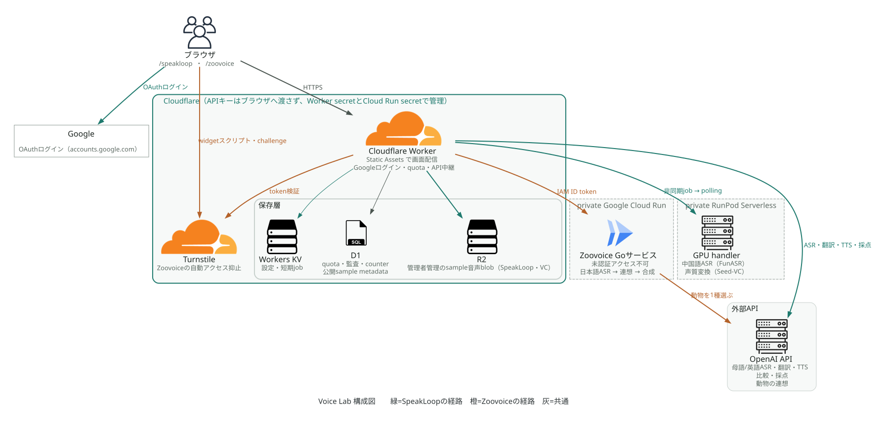
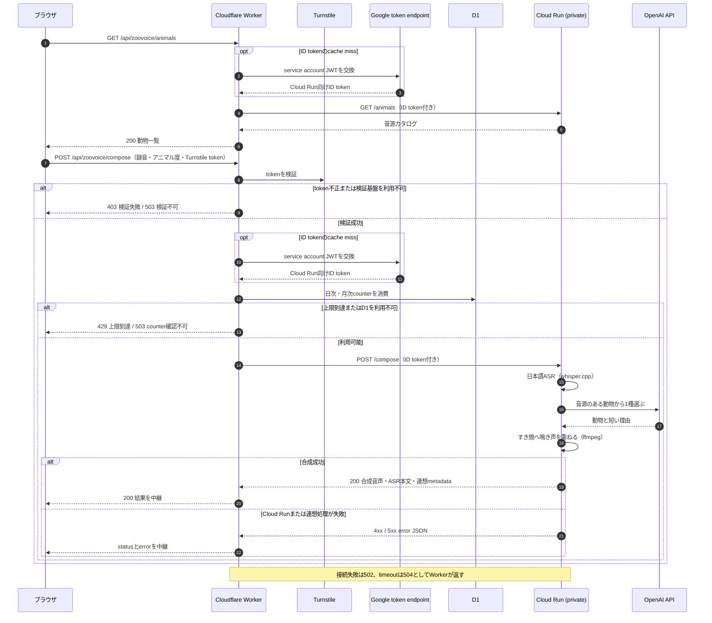

# 現在のデプロイ構成

更新日: 2026-08-22

## English summary

- Current deployment architecture. The Japanese text below is the source of truth.
- One Cloudflare Worker serves SpeakLoop and Zoovoice. Static Assets deliver the UI; the Worker module handles auth, quotas, and API relay.
- SpeakLoop GPU inference runs on RunPod Serverless. Zoovoice audio processing runs on a private Go service on Google Cloud Run (whisper.cpp / LLM animal association / ffmpeg).
- Data boundaries: KV for settings and short-lived jobs / D1 for quotas, audit, and counters / R2 for sample blobs. Practice audio is not stored as history.
- Cloud Run is private (IAM only). The Worker calls it with an ID token from a dedicated invoker service account holding only `roles/run.invoker`.
- Terraform (`infra/cloudflare/`, `infra/gcp/`) is the source of truth for cloud resources. The Worker script and secrets are managed by wrangler and gcloud.
- Deploy scripts default to dry-run; remote writes require explicit apply. Cloud Run images are pinned by digest.
- One check remains manual: a real `POST /api/zoovoice/compose` through production Turnstile needs a human and is not yet verified end to end.

## 構成

Voice Labの公開版は、1つのCloudflare WorkerでSpeakLoopとZoovoiceを配信する。UIはWorker Static Assets、認証・quota・API中継はWorker moduleが担当する。SpeakLoopのGPU推論はRunPod Serverless、Zoovoiceの音声処理はprivateなGoogle Cloud Run上のGoサービスが担当する。この構成はproduction公開環境へ反映済みである。



図は [architecture.py](../diagrams/architecture.py) から生成する。英日の2枚は `uv run --no-project --with diagrams python docs/diagrams/architecture.py` で再生成する。

SpeakLoopのローカル版はFastAPIがUIとAPIを配信する。ZoovoiceのローカルUIとAPIはFastAPIを使わず、Wrangler localのWorkerとGoサービスで確認する。

## routeと認証

| route | 用途 | 公開版 |
| --- | --- | --- |
| `/` | ポータル | 公開 |
| `/speakloop` | SpeakLoop | 公開 |
| `/zoovoice` | Zoovoice | `ZOOVOICE_ENABLED=1` の配備だけ公開 |
| `/admin` | 総合管理 | 管理者認証必須 |
| `/speakloop/admin` | SpeakLoop管理 | 管理者認証必須 |

SpeakLoopの公開生成APIと管理画面は同じGoogle OAuthセッションを使う。`ADMIN_GOOGLE_EMAILS`または保存済み設定に含まれるemailだけを管理者とする。管理APIは匿名利用者を401、通常Googleユーザーを403で拒否する。管理者は公開quotaを消費しないが、入力サイズ上限は引き続き適用する。別の管理パスワードや管理者cookieは持たない。

## データ境界

- KV: 設定、短期job snapshot、ready状態、binding不足時のfallback
- D1: email hashを使うquota、監査イベント、公開サンプルmetadata、Zoovoice利用counter
- R2: 管理者が登録したsample音声のblob
- RunPod: GPU jobの入力、途中progress、結果。長期保存の正にはしない
- Cloud Run: Zoovoiceの録音、合成音声、連想metadata。応答の生成に必要な間だけ扱い、永続保存しない

SpeakLoopの中国語比較はRunPodのjob IDをブラウザへ返し、WorkerまたはFastAPIがRunPod statusを都度中継する。Cloudflare側に練習音声やこのjob結果を履歴保存する必要はない。

詳細は [CLOUDFLARE.md](CLOUDFLARE.md)、[STORAGE.md](STORAGE.md)、[RUNPOD.md](RUNPOD.md) を参照する。

## Zoovoice

Zoovoiceは、録音した発話の内容から動物を1種だけ自動で選び、その鳴き声を発話のすき間へ重ねる機能である。GoサービスはprivateなCloud Runへdeploy済みである。公開Workerも有効化varsを含めてdeploy済みである。公開UIからのβ版バッジ削除は本branchで追加した変更であり、production未反映である。merge後にWorker deployとdeploy後smokeを実施する。

この節はリポジトリの現在のコードの構成を示す。日本語ASRと動物の自動連想はGoサービスへ実装済みである。Cloud Runとproduction Workerへのdeployは完了しており、有効化varsも `wrangler.toml` へ設定済みである。外部操作と実環境smokeの状況はこの節の末尾に示す。機能仕様は [SPEC.md](../speech-translation/SPEC.md) を正とする。

### 用語

- アニマル度とは、鳴き声の挿入頻度を決める設定を指す。通常UIで利用者が変えられる設定はこれだけとする。
- 動物の自動連想とは、ASR本文から動物1種を自動で選ぶ処理を指す。
- 連想metadataとは、選ばれた動物と、その動物を選んだ理由の短文を指す。

Workerは `ZOOVOICE_ENABLED=1` の配備だけでZoovoiceの公開routeとAPIを提供する。この値が未設定または `1` 以外の配備では、`/zoovoice` は404、`/api/zoovoice/animals` と `/api/zoovoice/compose` は503を返す。`GET /api/zoovoice/config` はflagの状態を伝えるため、無効な配備でも応答する。現在のproduction `wrangler.toml` は `ZOOVOICE_ENABLED="1"` を設定している。

Google Cloud Run上のGoコンテナは、日本語ASR、動物の自動連想、音声合成をこの順で担当する。自動連想はLLM（既定 `gpt-5.6-luna`）へ一本化しており、ASR本文と音源カタログの候補一覧を渡して1種を必ず選ばせる。辞書やConceptNetによる連想経路と、当てずっぽうのrandom選択は持たない。

#### 連想に使う有料APIの費用と依存

自動連想は外部の有料APIに依存する。合成1回につきOpenAIのResponses APIを1回だけ呼ぶ。送るのはASR本文と候補一覧である。候補一覧は音源を持つ動物のidと日本語名だけで、46種のとき約1,800文字である。受け取るのは動物id1つと60文字以内の理由なので、1回あたりの出力はごく短い。単価はOpenAIの公開価格に従うため、この文書には固定値を書かない。実測が要る場合は同じ入力で1回呼び、応答のusageを記録する。

月あたりの上限は利用counterで決まる。既定は1日100回、1か月1,200回である。`ZOOVOICE_DAILY_LIMIT` と `ZOOVOICE_MONTHLY_LIMIT` で変えられる。したがって連想APIの月間呼び出し回数は月次上限を超えない。

依存のリスクは3つある。第1に、このAPIが落ちると合成そのものが成立しない。辞書による代替経路を持たないためである。第2に、応答が遅いとCloud Runの処理時間がそのまま伸びる。第3に、価格改定や提供終了はこちらで制御できない。

代替案は検討済みである。辞書と意味ベクトルによる連想は品質が足りず廃止した。比較の実測は [ZOOVOICE_ASSOCIATION_CASE_STUDY.md](../speech-translation/ZOOVOICE_ASSOCIATION_CASE_STUDY.md) を正とする。一時的な失敗は `association_unavailable` として返し、利用者は同じ録音のまま再試行できる。認証の誤りなど作り直しても直らない失敗は `association_failed` として返す。

連想の候補と音声再生が参照する動物一覧は、音源manifest（`ZOOVOICE_SOUNDS_DIR` が指すディレクトリの `manifest.json`、image内では `/app/sounds/manifest.json`）を正とする。音源を持つ動物だけが候補になる。Cloud Runはprivate IAMを前提とし、ブラウザからCloud Runへ直接送る経路は持たない。ローカルのsmoke確認では、gcloud service account impersonationで取得した短期ID tokenをlocal Wrangler経由でこのGoサービスへ渡す。

productionのWorkerは `ZOOVOICE_ORIGIN_MODE="cloud-run"` で動き、専用invoker service accountのkeyから自力でID tokenを取得してCloud Runを呼ぶ。invoker service accountには対象service単位の `roles/run.invoker` だけを付与し、`allUsers` へは付与しない。認証フローとsecret運用の詳細は [CLOUDFLARE.md](CLOUDFLARE.md) を正とする。この認証の実装と契約testは完了している。invoker service accountの作成と権限付与、key発行、Worker secretの登録も完了している。



ブラウザが送るのは録音とアニマル度だけとする。動物と挿入位置はCloud Run側が決めるため、ブラウザから配置設定を送らない。Workerは合成応答を中継し、ASR本文と連想metadataを送信元と同じブラウザへ返す。

動物一覧はCloud RunのGo APIの `/animals` を中継して返す。実際に合成へ使う音源カタログと必ず同じ内容になる。この経路では音声データを扱わない。

Cloud Runへ載せるDocker imageは、Goバイナリに加えて実行に必要なDebian runtime、CA証明書、ffmpegを含める。これに日本語ASR用のwhisper.cpp commandとモデルを加える。commandとモデルはリポジトリで管理せず、build時にgit外の検証済みディレクトリから取り込む。取り込むcommitとSHA-256はbuildとdeploy scriptの両方で照合し、image labelへも残す。連想に使うLLMのAPIキーはimageへ焼き込まず、Cloud RunのsecretとしてOPENAI_API_KEYへ渡す。

音源素材はリポジトリで追跡せず、build時に `zoovoice_sounds` named contextから `/app/sounds` へ取り込む。素材の出所と採用hashは、そのセットの `manifest.json` を正とする。secretと開発用ファイルはimageへ含めない。containerはnon-rootで実行する。

ASRモデル、必要な外部command、LLMのAPIキーのいずれかが欠けた場合は起動しない。固定の動物へ黙って切り替えない。

D1へ追加するのは `zoovoice_usage_counters` テーブルだけである。対応するmigrationは `migrations/0004_zoovoice_usage_counters.sql` であり、本番D1へ適用済みである。データ境界は [PRIVACY.md](PRIVACY.md) を参照する。

ASR本文、録音、生成音声は応答の生成に必要な間だけ扱う。これらの永続保存先は持たず、D1、R2、application logへ書かない。

Cloud Runのregionは `us-central1` とする。サービス設定の正本はTerraform（`infra/gcp/`）で、次の値を宣言する。

- private（未認証アクセス不可）
- CPU 2、メモリ2GiB
- port 8080、timeout 90秒、concurrency 1
- min 0、max 2
- `OPENAI_API_KEY` はSecret Manager `zoovoice-openai-api-key` から渡す

`scripts/deploy_zoovoice_cloud_run.sh` が担当するのはimageだけである。imageはlocalでbuildし、`us-central1-docker.pkg.dev/<project>/voice-lab/zoovoice:<git-sha>` へpushする。Cloud Runへはtagではなくdigestを固定して指定し、image以外の設定は変更しない。

Cloud RunへGit repositoryを接続する自動buildは使わない。container imageのbuildとpushはローカルの配備scriptだけが行う。

配備scriptの実行modeはdry-run、local-only verification、明示applyの3つとする。既定はdry-runであり、remote writeを行うのは明示applyだけである。scriptは実行前に、whisper.cpp commitとASRモデルのSHA-256を検査する。local smokeでは実際のLLMを呼ぶため、`OPENAI_API_KEY` の指定も必須とする。

local-only verificationは、linux/amd64のCloud Run相当imageをlocal buildする。CPU 2とメモリ2GiBの上限付きでnon-root起動し、`/healthz` と `/compose` を確認する。出力するのはimage size、使用メモリ、起動までの時間、compose時間である。

上のCPUとメモリは現在の設定値であり、現在のimageでの実測の裏付けは無い。以前ここに載せていた数値は、連想をLLMへ移す前のimageのものだったため削除した。当時のimageはConceptNet indexを同梱し、鳴き声素材を同梱していなかった。再測定にはlinux/amd64 emulationでのbuildと、課金の発生するLLM呼び出しが1回必要である。

`whisper-cli` はDockerfileの `-DBUILD_SHARED_LIBS=OFF` により、whisper/ggmlのlibraryをstaticに組み込んでbuildしている。libstdc++・libm・libgcc_s・libc・動的loaderへは動的にlinkするため、完全なstatic binaryではない。

この測定はApple Silicon上のlinux/amd64 emulationで行っている。合成時間はemulationの影響を受けるため、Cloud Runの実CPU上の値とは一致しない。上記の値はすべてこのlocal環境の実測であり、Cloud Run実機では未確認である。

Wrangler localからGoサービスまでの通しは、Playwrightのe2eで別途確認済みである。この確認はDocker imageではなくnative localのGoサービスを使い、Turnstileのtest keyを経由する。確認する経路は録音から日本語ASR、動物の自動連想、音声合成を経て再生とダウンロードまでである。この通しはtest本体13.1秒、run全体13.7秒で成功している。

Cloud Run側の反映はCloudflare Worker deployとは別の外部操作gateとして扱う。GCP project `mo-speech-501706` のus-central1へ、private Cloud Run service `zoovoice` をdeploy済みである。次のremote操作は完了している。

- privateなArtifact Registryへのcontainer image push
- GCP projectでのCloud Run resource作成とdeploy実行
- invoker service accountの作成と対象serviceへの `roles/run.invoker` 付与
- invoker service account keyの発行とWorker secret登録
- production Turnstile widgetの作成
- 有効化varsの `wrangler.toml` への追加
- 本番D1へのZoovoice counter migration適用
- 有効化varsを含むproduction Workerのdeploy

実環境smokeで確認済みなのは次の範囲である。

- 公開 `GET /api/zoovoice/config` が200を返し、有効な状態とTurnstile必須を示すこと
- 公開 `GET /api/zoovoice/animals` が200で音源カタログを返すこと
- 公開 `/zoovoice` とZoovoice用JS assetが200で配信されること
- 実ブラウザでのUI表示、production Turnstile widgetの表示
- private Cloud Runの `/animals` と実音声の `POST /compose` が認証付きrequestで200を返すこと
- 認証なしのCloud Run直接requestが403で拒否されること

Worker経由の実 `POST /api/zoovoice/compose` は未確認である。この経路の通過にはproduction Turnstileの人間操作が必要なためである。CAPTCHAは回避しないため、自動smokeの対象にしない。Worker側のID token交換とorigin requestは、fake endpointを使う契約testで固定している。この1件の人間確認を終えるまで、公開経路全体を実地確認済みとして扱わない。

## IaC（Terraform）

CloudflareとGoogle Cloudの構成はTerraformを正本とする。コードは `infra/cloudflare/` と `infra/gcp/` に分かれており、片方の適用はもう片方へ波及しない。設計方針は `AGENTS.md` の「インフラ構成（IaC）」節を正とする。

Terraformが管理する対象は次のとおり。

- Cloudflare: KV `MO_SPEECH_KV`、D1 `mo-speech-demo-db`、R2 bucket 2つ、Turnstile widget `voice-lab-zoovoice`
- Google Cloud: Cloud Run service `zoovoice` の設定、Artifact Registry `voice-lab`、必要APIの有効化
- Google Cloud（続き）: Secret Manager `zoovoice-openai-api-key` の入れ物とアクセス権、invoker用service account 2つと関連IAM

Terraformが管理しない対象は次のとおり。

- Workerスクリプト本体とbinding（`wrangler deploy` と `wrangler.toml` が正）
- secretの値（`wrangler secret put` と `gcloud secrets versions add` が正）
- Cloud Runのimage digest（配備scriptが入れ替える。Terraformはimage差分を無視する）

### 認証

Cloudflare側は環境変数 `CLOUDFLARE_API_TOKEN` を使う。対象を絞ったAPI tokenをdashboardで発行するのが安全である。専用tokenを作らない場合は、`wrangler login` 済みのOAuth tokenを流用できる。OAuth tokenは約1時間で切れるため、先に `npx wrangler whoami` で更新してから読み出す。

```sh
export CLOUDFLARE_API_TOKEN=$(grep -m1 '^oauth_token' \
  ~/Library/Preferences/.wrangler/config/default.toml | sed 's/.*= *"\(.*\)"/\1/')
```

Google Cloud側は環境変数 `GOOGLE_OAUTH_ACCESS_TOKEN` を使う。こちらも約1時間で切れる。

```sh
export GOOGLE_OAUTH_ACCESS_TOKEN=$(gcloud auth print-access-token)
```

### 使い方

各ディレクトリで `terraform init` の後、`terraform plan` で実物との差分を確認する。既存資産の取り込み定義は `imports.tf` にあり、stateへの取り込みは `terraform import` で行う。planまでは自由に実行してよい。`terraform apply` はクラウド設定の変更にあたるため、そのターンの明示許可を必要とする。

`infra/gcp/` は変数 `smoke_invoker_principal` を必要とする。これはsmoke用service accountの短期tokenを取れる開発者のprincipalであり、値は `infra/gcp/terraform.tfvars` へ書く。個人アカウントを公開リポジトリへ残さないため、`*.tfvars` はgitで管理しない。

```
smoke_invoker_principal = "user:あなたのGoogleアカウント"
```

stateはローカルファイル（`terraform.tfstate`）で、gitでは管理しない。リモートbackendへ移す場合は、置き場（Cloud Storage bucket等）を明示許可の上で作成し、`terraform { backend }` blockを追加して `terraform init -migrate-state` を実行する。

## 将来の分割

productionでは単一Workerを正とする。staging環境は廃止したため、環境の分割は将来の分割候補に数えない。
