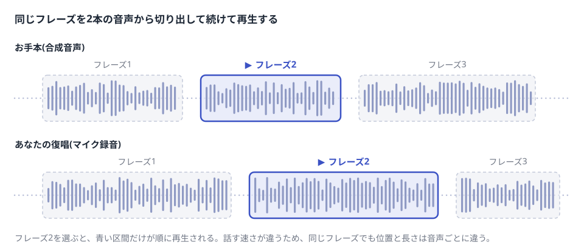
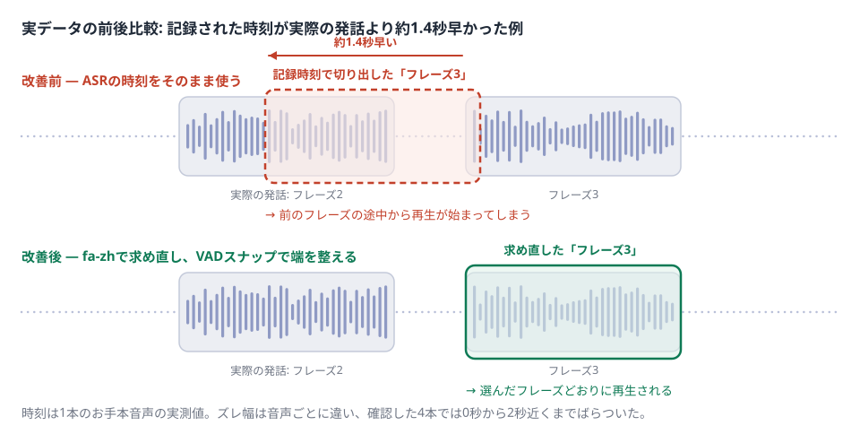
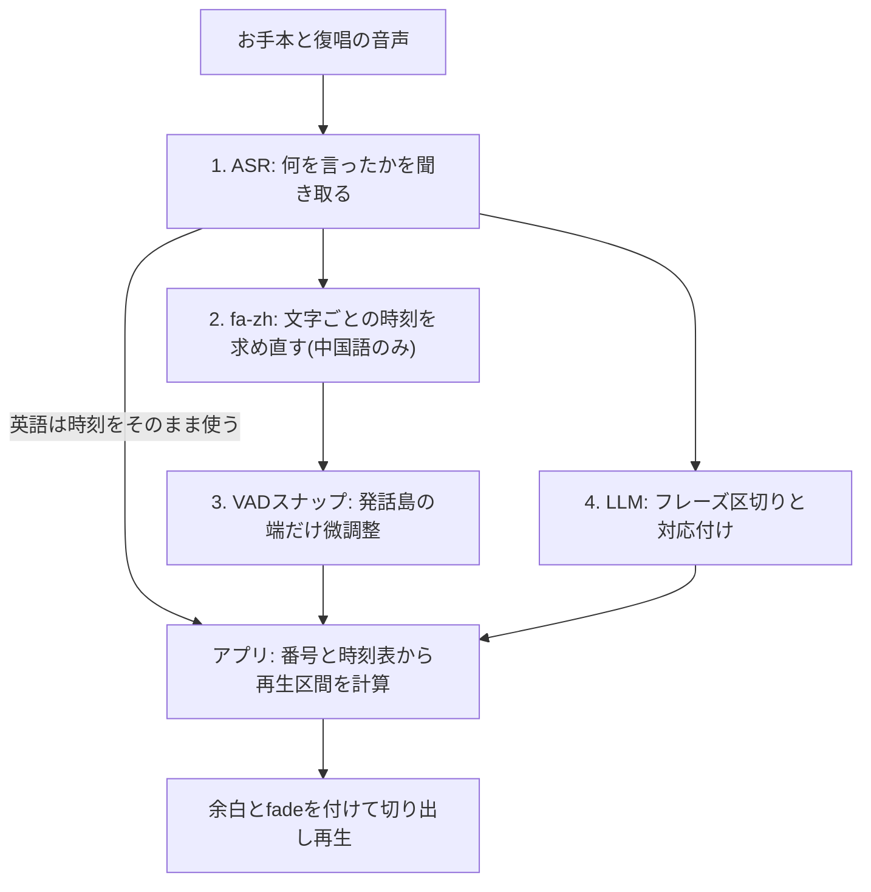
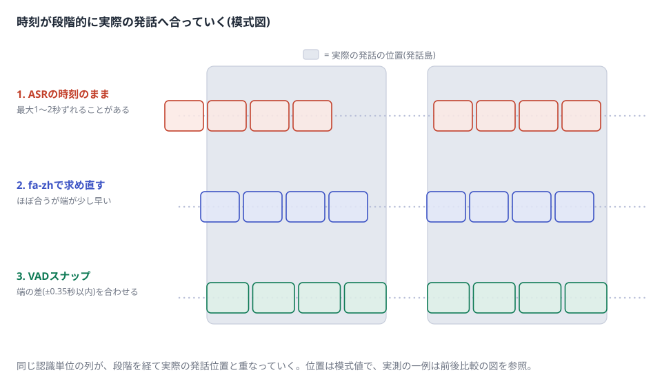
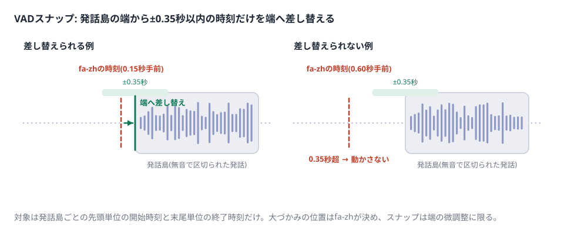
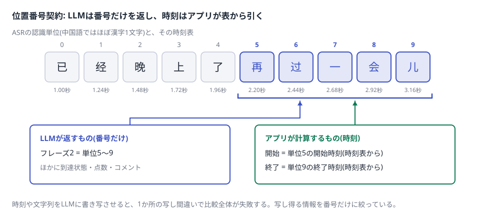
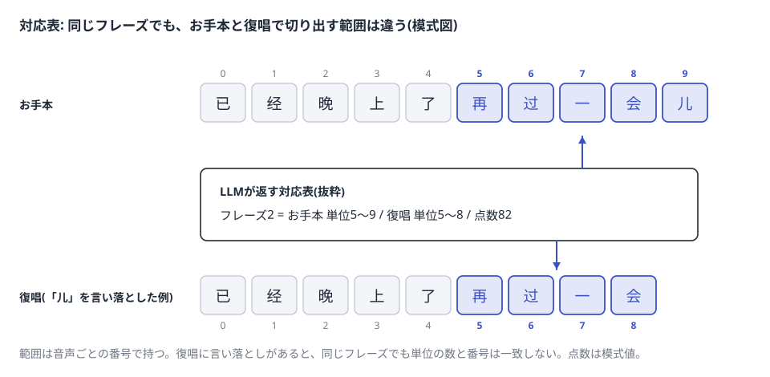
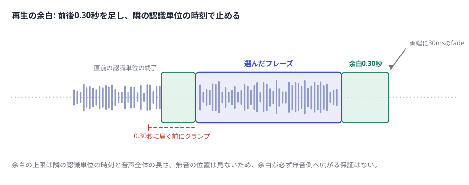

# 比較再生: 再生位置の決め方とその理由

更新日: 2026-08-24

SpeakLoopの比較再生について、再生位置をどう決めているかと、その形を選んだ理由を図解付きで説明する。仕様の正本は [SPEC.md](SPEC.md) であり、この文書は仕様を定めない。細部の経緯は `git log` に残している。

要点:

- 比較再生は、お手本と復唱を同じフレーズ単位で切り出して聞き比べる機能である。
- フレーズの区切りと対応付けはLLMが行い、再生時刻はアプリが計算する。
- 中国語の時刻はforced alignment（fa-zh）で求め直し、発話島（無音で区切られた発話のかたまり）の端に合わせて微調整する。
- 公開している数値は回帰確認用の指標であり、製品上の改善の証明ではない。

## 仕組み

フレーズを選ぶと、お手本と復唱の2つの音声から該当区間だけを切り出して続けて再生する。話す速さは人それぞれなので、同じフレーズでも位置と長さは音声ごとに違う。そのため音声ごとの時刻表（認識単位ごとの開始・終了時刻の一覧）が要る。

## 何が難しいか

この機能が成立する条件は2つある。フレーズが意味のまとまりで区切られていることと、時刻が実際の発話位置と合っていることである。初期の実装ではどちらも満たせていなかった。

**問題A: 区切りが意味と合わない。** 初期の実装は、意味を見ずに文字列の類似度で区切りと対応付けを決めていた。その結果、意味と無関係な場所で分かれることや、まったく分割されず全文が1フレーズになることが実際に起きた。区切りが意味と合っていなければ、時刻が正確でも聞き比べは成立しない。

**問題B: 再生位置が実際の発話とずれる。** ASRが返す時刻は認識の副産物で、精度の保証がない。中国語の実例では記録された時刻が実際の発話より約1.4秒早く、フレーズを選ぶと前のフレーズの途中から再生が始まった。ズレ幅は音声ごとに違い、確認した4本のお手本では0秒から2秒近くまでばらついた。

前後比較は1本の実データであり、一般的な改善量を示すものではない。図中のfa-zhとVADスナップは、次の用語の節で説明する。

## 用語

| 用語 | 意味 |
| --- | --- |
| ASR | 音声を文字にする技術。時刻付きの聞き取り結果を返す。 |
| 認識単位 | ASRが返す時刻付きの最小単位。中国語ではほぼ漢字1文字にあたる。 |
| 時刻表 | 認識単位ごとの開始・終了時刻の一覧。音声ごとに1つ持つ。 |
| forced alignment | 文章と音声をセットで渡し、文字ごとの時刻だけを当てさせる技術。中国語用の既製モデルがfa-zh。 |
| 発話島 | 無音で区切られた発話のかたまり。VAD（発話区間検出）で見つける。 |
| VADスナップ | 発話島ごとに、先頭の認識単位の開始時刻と末尾の認識単位の終了時刻だけを見る微調整。端との差が±0.35秒以内なら端へ合わせる。 |
| 位置番号契約 | LLMが場所を「何秒」ではなく認識単位の番号で指す取り決め。 |

## 再生位置が決まるまで — 4つの役割

再生位置は1つの処理では決まらない。4つの役割の分業で決まる。全体の流れは次のとおり。

1. **ASR — 何を言ったか。** 中国語はFunASR `paraformer-zh`（RunPod上）、英語はOpenAI `whisper-1`。次の工程へ渡す台本には、正解の目標文ではなく聞き取った文を使う。言い間違いがあっても、実際に口から出た文のほうが時刻を正確に合わせられる。
2. **fa-zh — 時刻を求め直す。** 中国語だけに使う。聞き取った文と音声から、文字ごとの時刻を専用モデルで当て直す。返ってきた単位数が認識単位数と合わないときは、ずれた対応を返さず処理を失敗させる。
3. **VADスナップ — 端へ寄せる。** これも中国語だけに使う。fa-zhの時刻がわずかに早めへ出る傾向を観測したため、発話島の端に近い時刻だけを端へ合わせる。±0.35秒を超えるズレは直せない。大づかみはfa-zh、細部はスナップという分担である。
4. **LLM — 区切りと対応付け。** フレーズごとの到達状態と点数、コメントも返す。場所を指すときは秒ではなく認識単位の番号を使う（位置番号契約）。失敗時に文字列類似度の比較へ切り替える予備の仕組みは持たない。

英語は役割2と3を通らず、ASRの時刻をそのまま使う。時刻を求め直さないため、英語ではASR時刻のズレがそのまま残り得る。英語側の時刻品質はまだ評価していない（評価の数値の節を参照）。

中国語では、役割1〜3を通ると同じ音声の時刻が段階的に実際の発話位置へ合っていく。

スナップが動くのは発話島の端の近くだけである。

役割4の結果が位置番号契約に基づく対応表である。LLMは番号だけを返し、時刻はアプリが時刻表から引く。

対応表はフレーズごとに、お手本と復唱それぞれの範囲を番号で持つ。復唱に言い落としがあると、同じフレーズでも単位の数と番号は音声ごとに違う。

LLMの返答は機械検査する。目標文が過不足なく再現できるか、番号が範囲内で順序どおりか、点数が0〜100かを確かめ、失敗したら比較結果を返さずエラーにする。ただしこれは形の検査であり、意味として良い区切りかは判定できない。

## なぜこの形にしたか

- **意味の判断と時刻の計算を分けた。** 区切り・対応付け・採点を1つの処理へまとめると、1つの調整が他へ波及する。意味の判断はLLM、時刻の計算はアプリへ分けた。
- **時刻は直さず、求め直す。** 1秒ズレた時刻を出発点に補正しても、正しい位置へ戻せる保証がない。fa-zhで時刻そのものを求め直し、VADスナップは±0.35秒の微調整に限る。
- **LLMに時刻を書き写させない。** 時刻や文字列を書き写させると、1か所の写し間違いで結果全体が失敗する。LLMは認識単位の番号だけを返し、時刻はアプリが計算する。

## 再生の余白

切り出しの前後には既定0.30秒の余白を付ける。ローカルFastAPI版では0.00〜0.50秒を0.05秒刻みで選べる。余白は隣の認識単位の時刻と音声全体の長さを超えないよう制限する。選んだ範囲そのものが削られることはない。再生の両端には30msのfadeがかかる。

余白の計算は無音検出を使わず、隣の認識単位の時刻で代用している。そのため余白が必ず無音の方向へ広がる保証はない。

## 保存済み履歴

保存済みの比較結果は、保存時点の値をそのまま再生する。過去の履歴の一括再計算や保存データの移行は行わない。ローカルFastAPI版だけ、表示時に現行ロジックでの再計算を選べる。再計算は表示確認専用で、保存データは書き換えない。Cloudflare公開版は音声履歴を保存しないため、この選択はない。

## 評価の数値

構成を入れ替えたときの劣化に気づくための指標を1つ持つ。スクリプトは `scripts/evaluate_fa_zh_alignment.py` である。このスクリプトが比較するのは2つの構成である。ASRの時刻をそのまま使う構成と、fa-zh＋VADスナップの採用構成を同じ集計で比べる。

測るのは、フレーズ境界と発話島の端との距離である。開始時刻は最寄りの発話島の開始との距離を測り、終了時刻は最寄りの発話島の終了との距離を測る。対象は中国語の実データ11音声・境界114個（2026-07-20のローカル計測）。表の値は復唱側とお手本側を合算した集計である。

| 構成 | 端との距離0.12秒以内 | 0.25秒以内 | 最大距離 |
| --- | ---: | ---: | ---: |
| ASRの時刻をそのまま使う | 59.6%（68/114） | 67.5%（77/114） | 1.768秒 |
| fa-zh＋VADスナップ（採用） | 87.7%（100/114） | 87.7%（100/114） | 1.244秒 |

採用構成で2つの閾値の件数が同じなのは、0.12〜0.25秒の距離に入る境界がこの計測には無かったためである。

この数値が示さないこと:

- 人手で作った正解境界に対する精度ではない。正解セットを持っていない。
- 利用者が体感する誤再生が解消したことの証明ではない。
- 採用構成は、評価に使う発話島とスナップに使う発話島が同じ検出結果である。そのため採用構成の値は一部が自己参照になっている。
- 計測に使った音声は公開していないため、第三者は上の数値そのものを再現できない。スクリプトは公開しており、手元の音声で同じ集計はできる。

評価していない範囲: フレーズ分割の意味的な質、英語側の時刻品質、利用者が感じる再生位置の妥当性。

## 図について

図の波形と模式図の位置・点数はイメージである。前後比較の図の時刻だけは実データで、対象は1本のお手本音声である。
