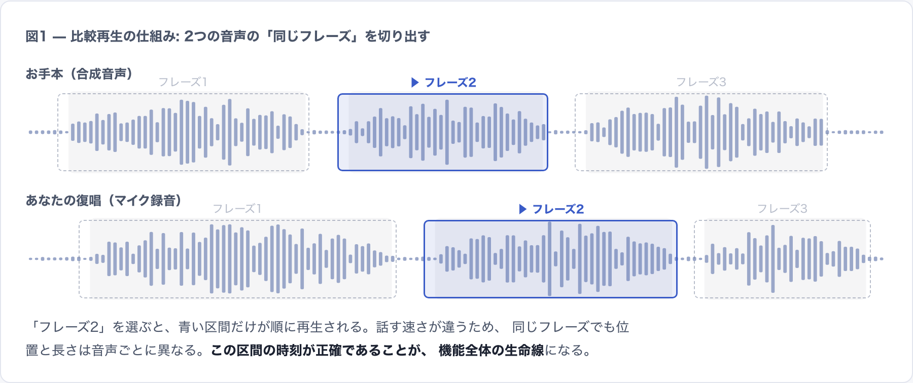
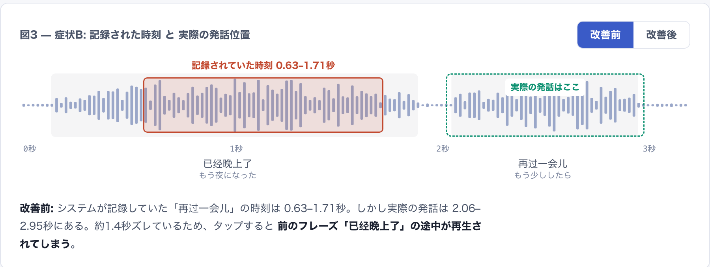
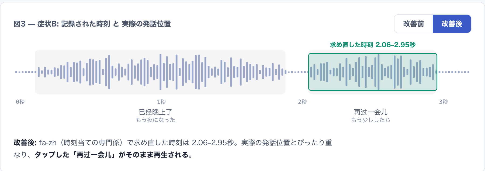

# 比較再生: 再生位置の設計と評価

更新日: 2026-08-02

この文書は、SpeakLoopの比較再生について現在の設計と評価方法を図解付きで説明する。仕様の正本は [SPEC.md](SPEC.md) であり、この文書は仕様を定めない。目的は、第三者が設計の狙いと失敗モード、評価上の限界を理解できるようにすることである。読者と用途が仕様書と異なるため、独立した文書として置いている。

要点:

- 比較再生は、お手本音声と復唱音声を同じフレーズ単位で切り出して聞き比べる機能である。
- フレーズ分割と対応付けはLLMが担い、再生時刻はアプリが位置番号から計算する。
- 中国語の時刻はforced alignment（fa-zh）で求め直し、±0.35秒以内にある発話島の縁へスナップする。
- 再生余白は、隣接する認識単位の境界でクランプする。
- 公開している数値はVAD整合性の回帰指標である。境界精度や製品上の改善を示すものではない。

## 用語

この文書で使う用語を先に定義する。

| 用語 | 意味 |
| --- | --- |
| ASR（自動音声認識） | 音声を文字にする技術。時刻付きの聞き取り結果を返す。 |
| TTS（音声合成） | 文字から音声を作る技術。お手本音声はこれで作る。 |
| 認識単位 | ASRが返す時刻付きの最小単位。中国語では文字単位になる。 |
| forced alignment（強制整列） | 文章と音声をセットで渡し、文字ごとの時刻だけを当てさせる技術。 |
| fa-zh | 中国語用のforced alignment既製モデル（FunASR）。 |
| VAD | 発話区間検出。音声のどこが発話でどこが無音かを見つける処理。 |
| 発話島 | 無音で区切られた発話のかたまり。この文書での呼び方。 |
| VADスナップ | フレーズ境界を±0.35秒以内にある発話島の縁へ吸着させる仕上げ処理。 |
| 位置番号契約 | LLMが場所を「何秒」ではなく認識単位の番号で指す取り決め。 |
| VAD整合性 | フレーズ境界と最寄りの発話島の縁との距離。この文書で使う評価指標の名前。 |
| paraformer | 採用している中国語ASRモデル。 |

## 比較再生の仕組み

比較再生は、お手本音声と自分の復唱をフレーズ単位で聞き比べる機能である。フレーズを選ぶと、2つの音声から該当区間だけを切り出して続けて再生する。

この機能は音声ごとの「時刻表」を前提にする。同じ文でも話す速さは違うため、フレーズの位置と長さは音声ごとに異なる。

## 想定している失敗モード

比較再生は2つの前提の上に成り立つ。フレーズが意味のまとまりで区切られていることと、区間の時刻が実際の発話位置と合っていることである。前提が崩れる方向は独立しており、対策も別になる。

### 失敗モードA: フレーズの区切りが崩れる

「隣のフレーズが少し混ざる」という軽い崩れ方だけではない。意味と無関係な場所で割れることや、まったく分割されず全文が1フレーズになることが起きうる。区切りが崩れると、時刻がどれほど正確でも聞き比べは成立しない。

これらの壊れ方の型は実使用での観測に基づく。

### 失敗モードB: 選んだ場所と違う音が鳴る

ASRが返す時刻は認識の途中計算から出る副産物であり、精度の保証がない。映画でいえば、字幕の文面は合っているのに表示タイミングがズレている状態にあたる。

実データの1例で説明する。お手本「已经晚上了。再过一会儿…」で2つ目のフレーズを選んだ場面である。ASRの時刻は0.63〜1.71秒だったが、実際の発話は2.06〜2.95秒にあった。約1.4秒ズレているため、選ぶと前のフレーズの途中が再生された。

図3はこの1本の音声だけを対象に、ASRの時刻をそのまま使った場合と現在の構成で求め直した場合を並べたものである。単一の実データ例であり、一般的な改善量を示すものではない。ズレ方は音声ごとに違い、確認した4本のお手本では0秒から2秒近くまでばらついた。

## 現在の設計: 4つの役割

現在の構成は、ASR・fa-zh・VADスナップ・LLMの4つへ役割を分けている。以下では各役割の担当範囲と制約を順に説明する。

### 役割1: ASRは「何を言ったか」に使う

中国語 `zh-CN` はRunPod上のFunASR `paraformer-zh`、英語 `en-US` はOpenAI `whisper-1` を使う。中国語では、このASR仮説の本文を次のforced alignmentへ渡す。

渡す台本には、正解の目標文ではなくASRが聞き取った文を使う。復唱には言い間違いがあり得るため、実際に口から出た文へ整列するほうが時刻が崩れにくい。

### 役割2: 時刻はforced alignmentで求め直す

forced alignmentは、文章と音声をセットで渡して文字ごとの時刻だけを当てさせる技術である。文字当てをやり直さず、時刻の割り当てだけを担当する。中国語用の既製モデルfa-zhをそのまま使う。

fa-zhは中国語の比較ASRだけに使う。token数が認識単位数と一致しない場合は、誤った位置対応を返さずjobを失敗させる。

### 役割3: VADスナップで縁へ寄せる

この評価サンプルでは、fa-zhの出力に境界がわずかに早めへ出る傾向を観測した。境界の±0.35秒以内に発話島の縁があれば、そこへ境界を寄せて仕上げる。差し替えるのは `words` の時刻だけで、認識単位の順序とLLMへ渡す位置番号は変えない。

スナップの適用範囲は±0.35秒に限られる。1秒以上ズレた境界の近くに正しい縁はないため、スナップ単独ではそうしたケースを直せない。fa-zhで大づかみに求め直し、スナップで細部を寄せるという順序を採っている。

### 役割4: フレーズ分割と対応付けはLLM

区切りと対応付けという意味の判断はLLMが行う。文字列類似度による旧比較処理は削除済みであり、LLM処理が失敗したときに旧処理へ切り替える分岐は持たない。LLMはフレーズごとの到達状態（`assigned`・`partial`・`missing`）と点数、コメントも同時に返す。

時刻はLLMへ転記させない。LLMが返すのは認識単位の位置番号であり、時刻・再生時刻・一致文字列はアプリが位置番号から計算する。これが位置番号契約である。

アプリが機械的に検査できるのは、次の構造上の契約である。

| 検査項目 | 内容 |
| --- | --- |
| 目標文の再構成 | フレーズの `target_text` を順にたどると、句読点を含む非空白の内容が元の目標文と同じ順序で過不足なく現れる。フレーズ境界での空白の配分の違いは許容し、フレーズ内部は原文どおりであることを求める。 |
| 通し番号 | `phrase_index` が0から連番で並ぶ。 |
| 位置番号の範囲 | `word_start_index` と `word_end_index` が認識単位配列の範囲内に収まる。 |
| 重複と順序 | 同じ側の範囲がフレーズ順に並び、前のフレーズと重複しない。 |
| 点数 | 0〜100の整数である。 |

いずれかに失敗した場合は、比較結果を返さずエラーにする。

これらはすべて構造の検査である。分割位置が意味として妥当かは判定しない。意味の切れ目を誤った分割でも、契約を満たす限り検出されない。

## 再生余白の決め方

切り出し再生では、選んだ範囲の前後へ共通の余白を付ける。既定は0.30秒で、ローカルFastAPI版では0.00〜0.50秒を0.05秒刻みで選べる。

余白は隣接する認識単位の境界でクランプする。開始側は直前の認識単位の終了時刻を超えず、終了側は直後の認識単位の開始時刻を超えない。音声全体の長さでも制限する。ブラウザは切り出し再生の両端へ30msのfadeを適用する。

この計算はVADや無音検出を入力に取らない。隣接する認識単位の時刻を無音の代わりに使っているため、次の点は保証されない。

- 余白が無音の方向へだけ広がること。認識単位の間隙が無音とは限らない。
- 発話島へ食い込まないこと。隣の認識単位の時刻がズレていれば、クランプ位置も同じだけズレる。

## 保存済み履歴の再生区間

保存済みの比較結果は、既定では保存時点の値をそのまま再生する。過去の履歴を一括で再計算することや、保存データを移行することは行わない。

ローカルFastAPI版では、履歴を表示するときに `保存値` と `現行ロジックで再計算` を選べる。既定は `保存値` である。再計算は表示確認専用で、保存データは書き換えない。

再計算の入力は、保存済みのASR単語時刻とLLMが返した位置番号である。LLMは呼び出さず、フレーズ分割・位置番号・点数・コメントは保存値をそのまま使う。計算するのは再生区間だけである。

再計算できない履歴もある。位置番号を持たない古い履歴、ASR単語が保存上限で切り詰められた履歴、お手本音声を対応付けできない履歴である。これらは理由を画面に示し、`保存値` のままにする。

Cloudflare公開版は音声履歴を保存しないため、この選択自体を持たない。

## 評価: VAD整合性の回帰指標

構成を入れ替えたときの回帰を見るために、保存済みの中国語音声で使う指標を1つ持っている。スクリプトは `scripts/evaluate_fa_zh_alignment.py` である。

測っているのは、各フレーズ境界と最寄りの発話島の縁との距離である。スクリプトは指標名を `vad_agreement_not_boundary_accuracy` として出力へ明示している。対象は中国語の実データ11音声・境界114個で、2026-07-20のローカルCPU計測である。

| 構成 | 縁との距離0.12秒以内 | 0.25秒以内 | 最大距離 |
| --- | ---: | ---: | ---: |
| ASRの時刻をそのまま使う | 59% | 68% | 1.77秒 |
| スナップだけ足す | 68% | 68% | 1.77秒 |
| fa-zhだけ | 63% | 83% | 1.24秒 |
| fa-zh＋スナップ（採用） | 89% | 89% | 1.24秒 |

0.25秒以内の割合が68%から89%へ変わったこと、最大距離が1.77秒から1.24秒へ変わったことは、いずれもこの指標上の値である。

### この指標が示さないこと

- 人手で作った正解境界に対する精度ではない。人手正解の評価セットは持っていない。
- 製品上の改善の証明ではない。利用者が体感する誤再生が解消したことの証明でもない。
- スナップを含む構成では、評価に使う発話島とスナップに使う発話島が同じ検出結果である。よって採用構成の値は一部が循環しており、他構成と同じ意味では読めない。
- ポーズなしで読まれた境界には、対応する縁がそもそも存在しない。この場合も距離が大きい側に数えられる。

用途は、11音声・114境界という固定条件での構成比較と回帰検知に限る。

### 指標上の残差の内訳

0.25秒を超えた境界の内訳は、距離の分布を見て2つの型に分けられる。これも指標上の観察であり、実害の測定ではない。

| 型 | 内容 |
| --- | --- |
| 大半 | フレーズ内のポーズや末尾の無音へ区間が少し食み出す。 |
| 実害が想定される型 | 境界の1文字がポーズの向こう側の島へ割り当たる（例: 文末の「了」）。1文字ぶんの欠けや混入が起きうる。 |

### 評価していない範囲

- フレーズ分割の意味的な質。固定の人手評価セットも、記録された試聴評価も持っていない。前述の構造検査は誤った意味分割を検出できない。
- 英語の時刻品質。fa-zhは中国語専用のため英語には適用していない。LLMによる分割と位置番号契約、再生余白とfadeは両言語共通だが、英語側での効果は測っていない。
- 利用者が感じる再生位置の妥当性。実使用での確認は行っているが、固定条件の記録は残していない。

## 図と数値の注記

- 数値は2026-07-20のローカルCPU計測で、対象は中国語11音声・境界114個である。
- 図1の波形はイメージである。
- 図3の時刻は実データであり、対象は1本のお手本音声である。
