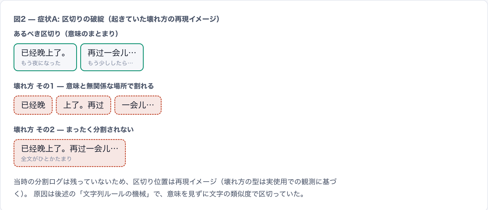
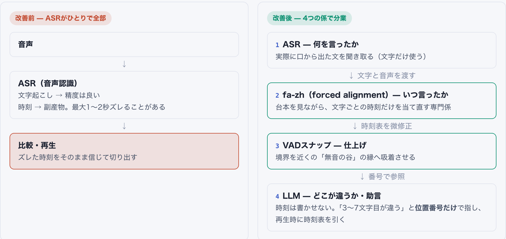
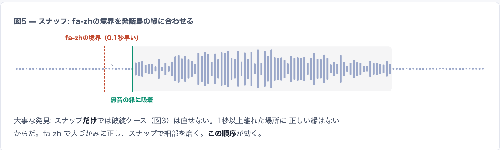
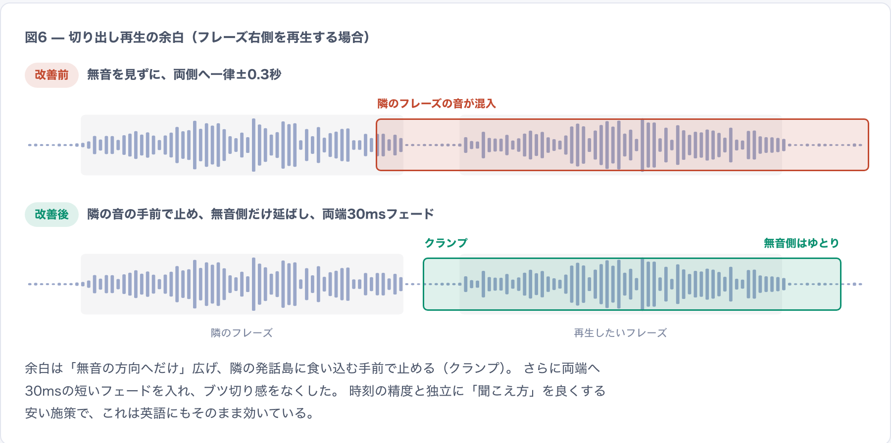
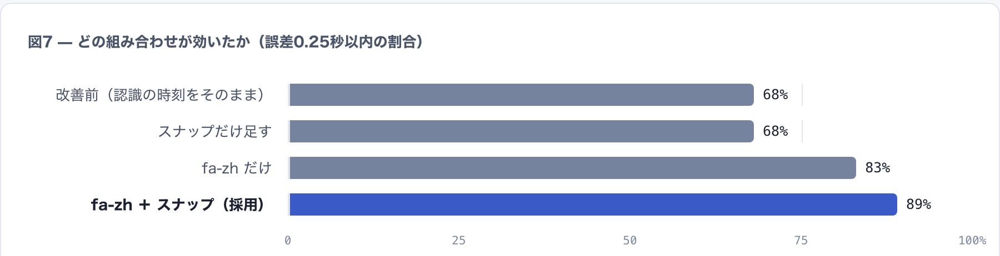

# 開発記録: 比較再生の再生位置問題

更新日: 2026-07-29

SpeakLoopの比較再生に、フレーズを選んで再生すると別の場所の音声が流れる問題があった。この文書は、その原因と対策の経緯を残す開発記録である。現在の実装仕様は [SPEC.md](SPEC.md) を正とする。経緯の読み物は仕様書と読者・用途が異なるため、既存文書へ統合せず独立の文書にした。

要約:

- 症状は2種類あった。フレーズ分割が崩れる症状Aと、再生位置がズレる症状Bである。
- 症状Aは、約3,600行の文字列ルールをLLMへの移管で置き換えて解決した。
- 症状Bは、forced alignmentとVADスナップの導入で解決した。境界誤差0.25秒以内の割合は68%から89%になった。
- 転機は、修正より先に計測を作ったことだった。

## 用語

この文書で使う用語を先に定義する。

| 用語 | 意味 |
| --- | --- |
| ASR（自動音声認識） | 音声を文字にする技術。時刻付きの聞き取り結果を返す。 |
| TTS（音声合成） | 文字から音声を作る技術。お手本音声はこれで作る。 |
| forced alignment（強制整列） | 文章と音声をセットで渡し、文字ごとの時刻だけを当てさせる技術。 |
| fa-zh | 中国語用のforced alignment既製モデル（FunASR）。 |
| VAD | 発話区間検出。音声のどこが発話でどこが無音かを見つける処理。 |
| 発話島 | 無音で区切られた発話のかたまり。この文書での呼び方。 |
| VADスナップ | フレーズ境界を±0.35秒以内にある発話島の縁へ吸着させる仕上げ処理。 |
| 位置番号契約 | LLMが場所を「何秒」ではなく聞き取り単位の番号で指す取り決め。 |
| paraformer | 採用している中国語ASRモデル。 |

## 比較再生の仕組み

比較再生は、お手本音声と自分の復唱をフレーズ単位で聞き比べる機能である。フレーズを選ぶと、2つの音声から該当区間だけを切り出して続けて再生する。

この機能は音声ごとの「時刻表」を前提にする。同じ文でも話す速さは違うため、フレーズの位置と長さは音声ごとに異なる。

## 症状

症状は独立した2種類があり、分けて捉えるまでに時間がかかった。

### 症状A: フレーズの区切りが崩れる

「隣のフレーズが少し混ざる」という軽い症状ではなかった。意味と無関係な場所で割れたり、まったく分割されず全文が1フレーズになったりした。区切りが崩れると、時刻がどれほど正確でも聞き比べは成立しない。

図2の区切り位置は再現イメージである。壊れ方の型は実使用での観測に基づくが、当時の分割ログは残っていない。

### 症状B: 選んだ場所と違う音が鳴る

こちらは実データの1例で説明できる。お手本「已经晚上了。再过一会儿…」で、2つ目のフレーズを選んだ場面である。記録されていた時刻は0.63〜1.71秒だったが、実際の発話は2.06〜2.95秒にあった。約1.4秒ズレているため、選ぶと前のフレーズの途中が再生されていた。

図3は同じ音声の改善前と改善後である。ズレ方は音声ごとに違い、0秒から2秒近くまでばらついた。計測した4本のお手本のうち2本がこの水準で壊れていた。

## 原因

原因は「意味」と「時刻」の2系統だった。

症状Aの原因は、区切りと対応付けを担っていた自作の文字列ルールである。目標文と聞き取り結果を文字の類似度で突き合わせる仕組みで、Python側だけで約3,600行・84関数まで育っていた。声調や同音異字に揺さぶられ、意味を見ないまま区切っていた。1ケースを直すルールを足すたびに、別のケースが壊れた。

症状Bの原因は時刻表の出どころである。時刻はASRが認識の途中計算から出す副産物で、精度の保証がない。映画でいえば、字幕の文面は合っているのに表示タイミングが最大2秒ズレている状態だった。

| 区分 | 内容 |
| --- | --- |
| 症状Aの原因 | 文字列ルールの破綻。意味を見ずに文字の類似度で区切っていた。 |
| 症状Bの主因 | paraformerが出す時刻のドリフト。お手本（TTS音声）側で最大1〜2秒ズレる。 |
| 症状Bの副因 | 固定±0.3秒の再生余白。無音を見ずに付くため、隣のフレーズの音が混入する。 |

## 迷走と転機

当初は、二正面でルールを磨く戦いだった。分割ルールの修正と時刻の後補正を重ねたが、体感は変わらなかった。2026-07-19に、時刻補正のPRは補正部分を取り下げて終わった。

敗因は2つある。

- 戦う場所の間違い。上流が秒単位で壊れているのに、下流でミリ秒を磨いていた。
- 物差しの不在。良くなったかを数える指標がなかった。

転機は、修正より先に計測を作ったことだった。ffmpegの無音検出で発話島を割り出し、境界と最寄りの縁との距離を数えるようにした。測れるようになった日のうちに、主因の特定と対策候補の比較まで進んだ。

## 対策: 4つの分業

改善前は、ASRが文字起こしと時刻決めを1人で担っていた。その出力を文字列ルールが区切って対応付けていた。改善後は、次の4つの係へ仕事を分けた。

### 柱1: フレーズ分割と対応付けをLLMへ

区切りと対応付けという意味の判断をLLMへ移した。LLMは意味のまとまりで区切れるうえ、言い直しを許容する対応付けが得意である。フレーズごとの到達状態（言えた・部分的・言えていない）も同時に返す。

初版にはLLMへ時刻の転記もさせる設計上の落とし穴があった。転記ミス1つで比較全体が失敗する事故が起きたため、番号だけを返す位置番号契約へ再設計した。時刻や文字列はアプリが時刻表から計算する。アプリ側の検査は機械チェックに絞った。フレーズの連結が目標文と一致することや、番号が範囲内で重複なく順序どおりに並ぶことなどを確かめる。

この移管で、旧ルールのうち到達不能になった約3,300行を削除できた。

### 柱2: forced alignmentで時刻を求め直す

forced alignmentは、文章と音声をセットで渡して文字ごとの時刻だけを当てさせる技術である。文字当てをやり直さないぶん、時刻当てに集中でき原理的に頑健になる。中国語用の既製モデルfa-zhをそのまま使った。

渡す台本には、正解の文ではなくASRが聞き取った文を使う。復唱には言い間違いがあり得るため、実際に口から出た文へ整列するほうが時刻が崩れない。

### 柱3: VADスナップ

fa-zhは全体を正しく捉える一方で、約0.1秒だけ早めに出る癖があった。境界の±0.35秒以内に無音の縁があれば、そこへ境界を寄せて仕上げる。

スナップだけでは破綻ケースを直せない。1秒以上離れた場所に正しい縁はないからである。fa-zhで大づかみに正し、スナップで細部を磨くという順序が効いた。

### 柱4: 再生余白の作り直し

固定±0.3秒の余白をやめた。余白は無音の方向へだけ広げ、隣の発話島へ食い込む手前で止める。両端へ30msの短いフェードを入れ、ブツ切り感をなくした。この施策は時刻の精度と独立に聞こえ方を良くし、英語にもそのまま効いている。

## 結果

中国語の実データ11音声・境界114個で、改善前後を同じ物差しで計測した（2026-07-20、ローカルCPU）。境界誤差0.25秒以内の割合は68%から89%になった。最大のズレは1.77秒から1.24秒になり、フレーズ丸ごと別の場所が鳴る破綻は解消した。

| 構成 | 0.12秒以内 | 0.25秒以内 | 最大ズレ |
| --- | ---: | ---: | ---: |
| 改善前（認識の時刻をそのまま） | 59% | 68% | 1.77秒 |
| スナップだけ足す | 68% | 68% | 1.77秒 |
| fa-zhだけ | 63% | 83% | 1.24秒 |
| fa-zh＋スナップ（採用） | 89% | 89% | 1.24秒 |

スナップだけでは68%のままで、fa-zhだけでは83%だった。両方を組み合わせて89%になった。

この計測の「正解」は無音の縁を代理に使う近似値である。ポーズなしで読まれた境界は実際より悪く数えられるため、構成どうしの比較のための数字である。計測の後継スクリプトは `scripts/evaluate_fa_zh_alignment.py` として残している。

### フレーズ分割の質

区切りと対応付けの質を測る自動指標は現状持っていない。根拠は位置番号契約の機械検査と、実使用での確認である。

### 英語への効果

fa-zhは中国語専用のため、英語の改善はこれによるものではない。英語に効いたのは両言語共通の変更である。内訳はLLM化と位置番号契約、再生余白とフェード、無音録音のガード、お手本ASRのキャッシュである。英語側の時刻がお手本ほど壊れていなかったという説明は、履歴からの推測である。

### 過去の保存結果

保存済みの過去結果も、現行ロジックで比較区間を再計算して波及させた。

## 残る課題: 89%の内訳と次の一手

89%は辛めの物差しの値である。正解の縁が存在しない境界も誤差として数えるため、下限寄りの見積もりになる。残り11%の中身は計測で型まで特定できている。

| 型 | 内容 |
| --- | --- |
| 大半（ほぼ無害） | フレーズ内のポーズや末尾の無音へ区間が少し食み出す。再生上はほとんど気づかない。 |
| 実害が残る型 | 境界の1文字がポーズの向こう側の島へ割り当たる（例: 文末の「了」）。1文字ぶんの欠け・混入が起きうる。 |

95%以上へ近づける候補は、実害の確認を着手条件として次の表に残す。

| 候補 | 期待する効果 | 着手条件 |
| --- | --- | --- |
| 人手正解の評価セット（20〜50発話） | 物差しの頭打ちが外れ、89%が実力か測定誤差かを切り分けられる | 品質を数字で追い込む段階に入ったとき |
| 境界文字の再割り当て | 「実害が残る型」を直接潰す。型が特定済みで変更は小さい | 該当ケースでの実害の再確認 |
| ニューラルVADへの置換（silero-vad） | 無音の縁の検出がノイズ混じりの録音でも安定する | 現行のffmpeg無音検出で縁がズレる実例の確認 |
| 英語側の専用アライナ（torchaudio MMS_FA） | fa-zhと同じ改善を英語へ展開できる | 英語で時刻起因の実害の確認 |

次の伸びしろは、新しいアルゴリズムより先に正解データにある。95%を目指す作業も「測れるようにする」から始まる。

## 年表

| 期間 | 出来事 |
| --- | --- |
| 2026-06-30〜07-06 | 比較再生の初期実装と調整。ズレの報告が始まる。 |
| 07-16〜07-17 | 文字列ルールの修正と時刻の後補正（[PR #13](https://github.com/inakaegg/voice-lab/pull/13)、[PR #15](https://github.com/inakaegg/voice-lab/pull/15)）。体感が変わらない。 |
| 07-19 | 後補正アプローチを取り下げ（[PR #19](https://github.com/inakaegg/voice-lab/pull/19)）。 |
| 07-19〜07-20 | フレーズ分割・対応付け・採点のLLM化と位置番号契約（[PR #22](https://github.com/inakaegg/voice-lab/pull/22)）。旧ルールの削除は[PR #23](https://github.com/inakaegg/voice-lab/pull/23)。 |
| 07-20 | 計測ハーネスを作成し主因を特定。fa-zhの効果を11音声で検証（68%→89%）。 |
| 07-20〜07-22 | fa-zh整列＋VADスナップ＋余白改善の本実装（[PR #40](https://github.com/inakaegg/voice-lab/pull/40)）。 |
| 07-21〜07-22 | 保存済み結果の表示復元と再計算（[PR #36](https://github.com/inakaegg/voice-lab/pull/36)、[PR #37](https://github.com/inakaegg/voice-lab/pull/37)）。 |

## 計測条件と注記

- 数値は2026-07-20のローカルCPU計測で、対象は中国語11音声・境界114個である。
- 図1・図5・図6の波形はイメージである。
- 図2は壊れ方の再現イメージで、図3の時刻は実データである。
- 経緯の詳細は各PRとGit履歴を正とする。
